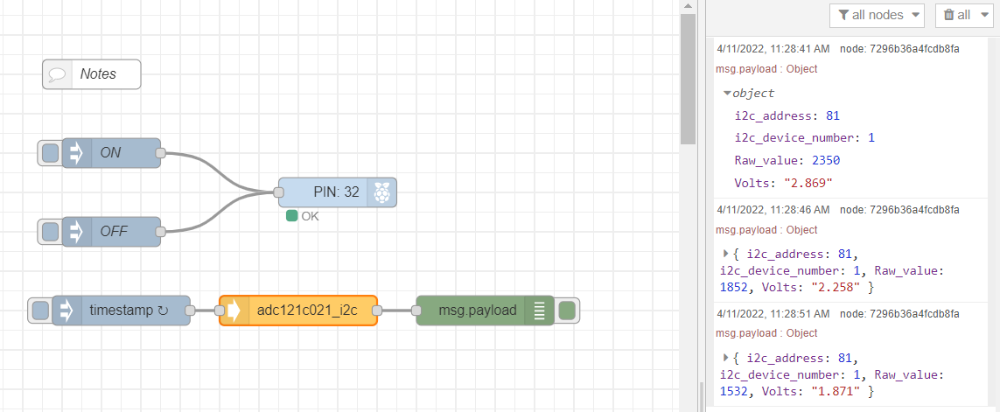

# node-red-contrib-adc121c021

The node-red-contrib-adc121c021 node allows users to read analog inputs from adc121c021 and then convert them to digital readings. 

**Tips**: Please make sure that user has the permissions to access GPIO and i2c devices, otherwise user can neither enable the adc121c021 chip nor read from the chip. 

---

## Install

Please install `node-red-contrib-ads7830` node with the following commands. If you use docker of Node-RED, you may need to replace `~/.node-red` with `/usr/src/node-red`,

```
git clone -b dev https://git.rak-internal.net/product-rd/gateway/wis-developer/rak7391/node-red-nodes.git
```

then copy `node-red-contrib-adc121c021` directory  to  the `node_modules` directory,

```
cp -rf node-red-nodes/node-red-contrib-adc121c021 ~/.node-red/node_modules
```

lastly, change to the `node-red-contrib-adc121c021` directory and install the node, 

```
cd ~/.node-red/node_modules/node-red-contrib-adc121c021 && npm install
```

**Tips:**  After the installation of  `node-red-contrib-adc121c021`  is finished, please restart your node-red service.  Otherwise, the node cannot be found/added to the new flow.

## Usage

To get the voltage reading from the adc121c021, user only need to define the i2c bus of the chip. 


- **Name**

​		Define the message name if you wish to change the name displayed on the node.

- **/dev/i2c-?**

​		Default I2C Bus is `1`.  `1` is for `'/dev/i2c-1'`.

- **i2c_Address**

​		The Address by default is set to `0x51`, this is the I2C address of RAK12004. Please check [adc121c021's datasheet](https://www.ti.com/lit/ds/symlink/adc121c021.pdf?ts=1649592829477&ref_url=https%253A%252F%252Fwww.google.com%252F) for more information. 

The output of the node is a payload contains the I2C address, the I2C device number (bus number), raw ADC readings, and the calculated voltage measurements.

```
{
	i2c_address: 81

	i2c_device_number: 1

	Raw_value: 2350

	Volts:  "2.869"
}
```


## Example

The ADC chip has an `EN pin` that must be `pulled high` before the reading, thus you need to enable the pin by using another node-red node called `node-red-node-pi-gpiod`.  It requires the [pi-gpiod](http://abyz.me.uk/rpi/pigpio/index.html) daemon to be running in order to work.

There are detailed instructions on how to make it works in container, please check this [guide](https://git.rak-internal.net/product-rd/gateway/wis-developer/rak7391/wisblock-node-red/-/tree/dev/other/gpio/gpio-toggle-led) on `node-red-node-pi-gpiod` created by RAKwireless and also the node's [offical webpage](https://flows.nodered.org/node/node-red-node-pi-gpiod).

Once your installed the node in Node-RED,  import [adc121c021-reading.json](./examples/adc121c021-reading.json) flow example into Node-RED.  Deploy and test the example, the result will be as follows.




## Tested hardware

- [RAK12004](https://store.rakwireless.com/products/mq2-gas-sensor-module-rak12004) (address: `0x51`) 

- [RAK12009](https://store.rakwireless.com/products/wisblock-mq3-gas-sensor-rak12009) (address: `0x55`) 


## License

This project is licensed under MIT license.
