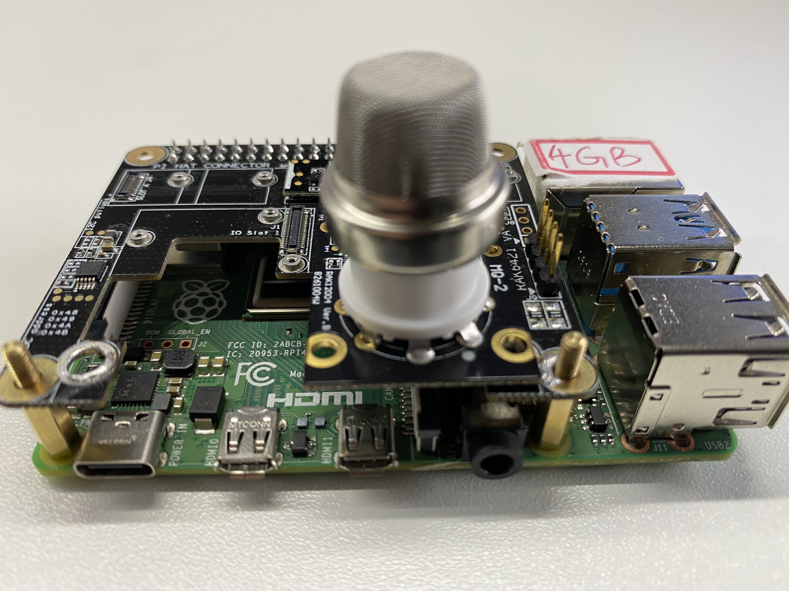
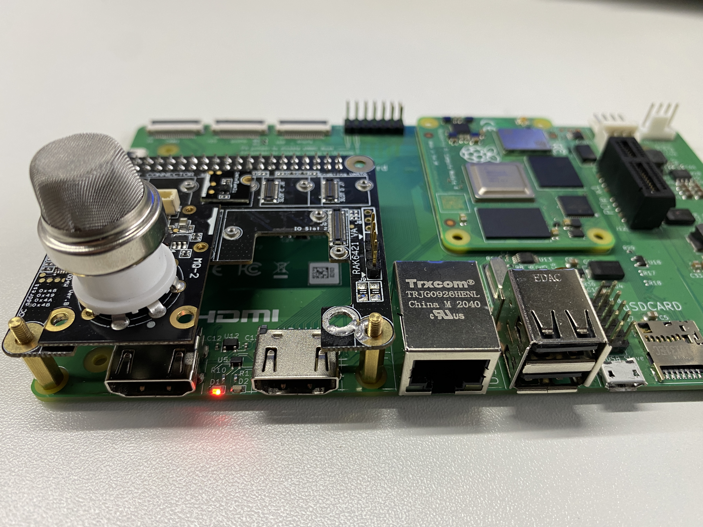
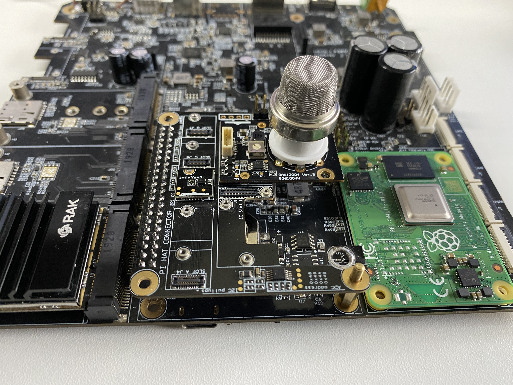
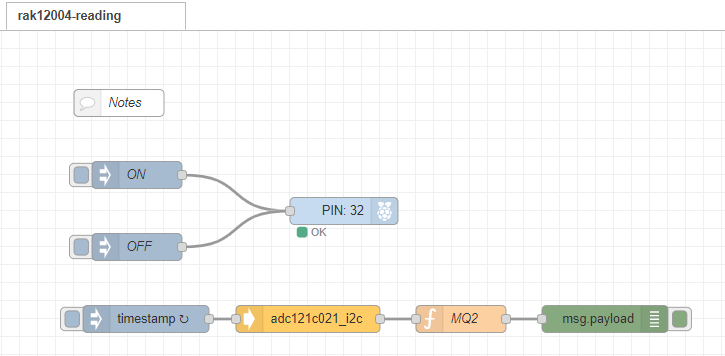
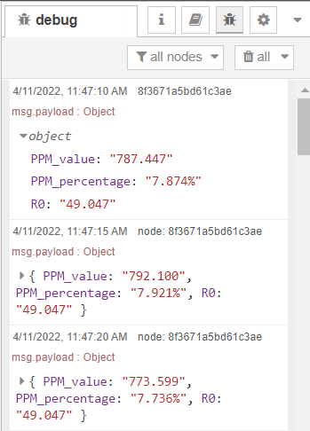

# Read smoke PPM using WisBlock sensor RAK12004 

## 1 Introduction

This guide explains how to use the [WisBlock Sensor RAK12004](https://docs.rakwireless.com/Product-Categories/WisBlock/RAK12004/Overview/) in combination with RAK6421 Wisblock Hat or RAK7391 WisGate Developer Connect to measure smoke's PPM through the I2C interface using Node-RED.  

### 1.1 RAK12004

The **RAK12004** is a gas sensor module which has an electronic sensor used for sensing the concentration of gases in the air. The sensor used is the [MQ2](https://www.pololu.com/file/0J309/MQ2.pdf) from Zhengzhou Winsen Electronics, it contains a sensing material whose resistance changes when it comes in contact with the gas.

MQ-2 gas sensor has a high sensitivity to LPG, Propane, and Hydrogen, also could be used for Methane and other combustible steam. For more information about RAK12004, refer to the [Datasheet](https://docs.rakwireless.com/Product-Categories/WisBlock/RAK12004/Datasheet/).

In RAK12004, the concentrations of gas is measured using a voltage divider network present in the sensor. The output of the sensing element is connected to a 12-bit ADC (ADC121C021) which communicates through I2C to the application. 

## 2 Preparation

### 2.1 Hardware

The device address of RAK12004 is configured to `0x51`, and connected to i2c bus `1`.

There are three ways to mount RAK12004:

- **Raspberry Pi 4B + RAK6421 WisBlock Hat +  RAK12004**

   

   

- **Raspberry Pi CM4 + Compute Module 4 IO Board + RAK6421 WisBlock Hat + RAK12004**

   

   

- **Raspberry Pi CM4  + RAK7391 WisGate Developer Connect + RAK6421 WisBlock Hat + RAK12004**

   

### 2.2 Software

The node we used in this flow is **[node-red-contrib-adc121c021](https://git.rak-internal.net/product-rd/gateway/wis-developer/rak7391/node-red-nodes/-/tree/dev/node-red-contrib-adc121c021)**, as well as the **[node-red-node-pi-gpiod](https://flows.nodered.org/node/node-red-node-pi-gpiod)** node.  Please install them before.

The `node-red-node-pi-gpiod` is used to pull the `EN pin` that must be pulled high before ASC121C021 can read analog inputs, and it requires the [pi-gpiod](http://abyz.me.uk/rpi/pigpio/index.html) daemon to be running in order to work. 

The `node-red-contrib-adc121c021` provides the very basic configuration for users to configure, the user only needs to define the i2c bus of the chip. The chip is set to the automatic conversion mode by default, and the cycle time is set to 32. 

## 3 Run example

Import the  [rak12004-reading.json](rak12004-reading.json)  file into your new flow. Then, the new flow should look like this:

As we mentioned in the node introduction section, the `node-red-node-pi-gpiod` node is used to pull the EN pin that must be pulled high before ASC121C021 can read analog input.

Hit the **Deploy** button on the top right to deploy the flow. 

The output of the node is a payload that contains the PPM value, percentage readings, and the value of R0,

## 4. License

This project is licensed under MIT license.
