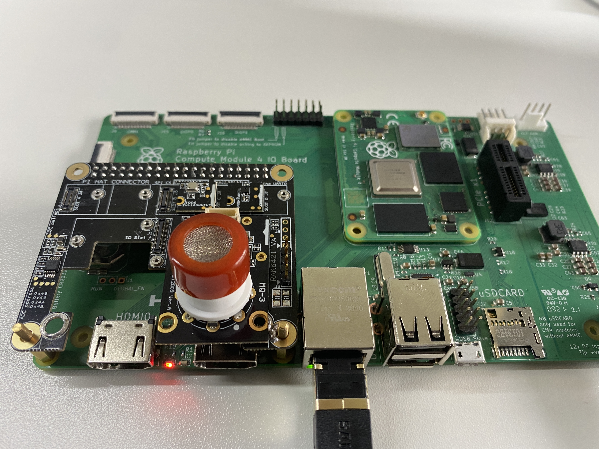
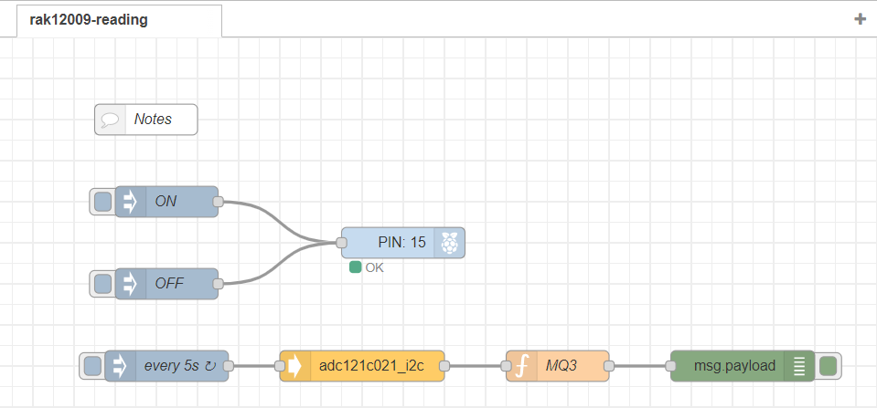

# Read Alcohol Gas  PPM Using WisBlock Sensor RAK12009 from Node-RED 

## 1 Introduction

This guide explains how to use the [WisBlock Sensor RAK12009](https://docs.rakwireless.com/Product-Categories/WisBlock/RAK12009/Overview/) in combination with RAK6421 Wisblock Hat or RAK7391 WisGate Developer Connect to measure alcohol gas PPM through the I2C interface using Node-RED.  

### 1.1 RAK12009

The RAK12009 is an Alcohol Gas Sensor module. The sensor used in this module is the MQ-3B from Zhengzhou Winsen Electronics. 

This sensor is capable of detecting alcohol gas in the air with an alcohol concentration detection range of 25 to 500 ppm.For more information about RAK12009, refer to the [Datasheet](https://docs.rakwireless.com/Product-Categories/WisBlock/RAK12009/Datasheet/).

## 2 Preparation

### 2.1 Hardware

The device address of RAK12009 is configured to `0x54`, and connected to i2c bus `1`.

There are three ways to mount RAK12009:

- **Raspberry Pi 4B + RAK6421 WisBlock Hat +  RAK12009**

   

   

- **Raspberry Pi CM4 + Compute Module 4 IO Board + RAK6421 WisBlock Hat + RAK12009**

   

   

- **Raspberry Pi CM4  + RAK7391 WisGate Developer Connect + RAK6421 WisBlock Hat + RAK12009**

   

### 2.2 Software

The node we used in this flow is **[node-red-contrib-adc121c021](https://git.rak-internal.net/product-rd/gateway/wis-developer/rak7391/node-red-nodes/-/tree/dev/node-red-contrib-adc121c021)**, as well as the **[node-red-node-pi-gpiod](https://flows.nodered.org/node/node-red-node-pi-gpiod)** node.  Please intall them before.

The `node-red-node-pi-gpiod` is used to pull the `EN pin` that must be pulled high before ADC121C021 can read analog inputs, and it requires the [pi-gpiod](http://abyz.me.uk/rpi/pigpio/index.html) daemon to be running in order to work. 

The `node-red-contrib-adc121c021` provides the very basic configuration for users to configure, the user only needs to define the i2c bus of the chip. The chip is set to the automatic conversion mode by default, and the cycle time is set to 32. 

## 3. Run example

Import  [**rak12009-reading.json**](rak2009-reading.json) flow, then the new flow should look like this:

As we mentioned in the node introduction section, the `node-red-node-pi-gpiod` node is used to pull the EN pin that must be pulled high before ASC121C021 can read analog input.

Hit the **Deploy** button on the top right to deploy the flow. 

The output of the node is a payload that contains the PPM value, the percentage readings, and also the value of R0,

## 4. License

This project is licensed under MIT license.
