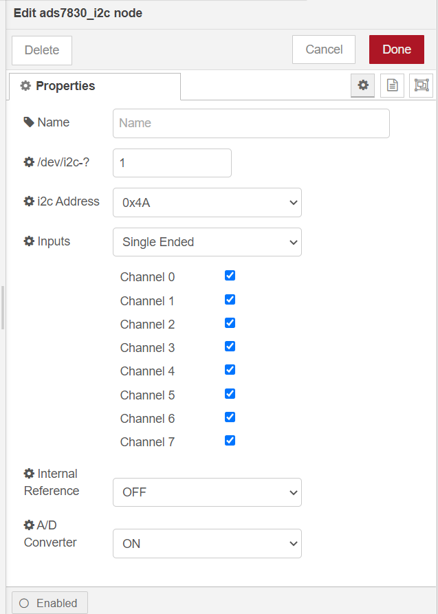

node-red-contrib-ads7830
==================================

A node-red node providing access to a ADS7830 I2C analog to digital converter.

**Tips**: Please make sure that user of system has the permissions to access i2c device, or  you cannot get  the result you want when use ads7830 node,  the result  will be `empty`.

---

## Install

Please install `node-red-contrib-ads7830` node with the following commands. If you use docker of Node-RED, you may need to replace `~/.node-red` with `/usr/src/node-red`.

```
git clone -b dev https://git.rak-internal.net/product-rd/gateway/wis-developer/rak7391/node-red-nodes.git
```

```
cp -rf node-red-nodes/node-red-contrib-ads7830 ~/.node-red/node_modules
```

```
cd ~/.node-red/node_modules/node-red-contrib-ads7830 && npm install
```


## Usage

To get a voltage or difference of voltage from a ADS7830  analog to digital converter just select the correct setting for your device and trigger the node.



- **Name**

  Define the msg name if you wish to change the name displayed on the node.

- **/dev/i2c-?**

  Default I2C Bus is 1.  `1` is for `'/dev/i2c-1'`.

- **i2c_Address**

  The Address by default is set to `0x4A`. You can setup the ADS7830 with one of four addresses, 0x48, 0x49, 0x4a, 0x4b. Please see ads7830 documentation for more information.

- **Inputs**

  Inputs may be used for Single-ended measurements (like A0-GND) or Differential measurements (like A0-A1). Single-ended measurements measure voltages relative to a shared reference point which is almost always the main units ground. Differential measurements are “floating”, meaning that it has no reference to ground. The measurement is taken as the voltage difference between the two wires. Example: The voltage of a battery can be taken by connecting A0 to one terminal and A1 to the othe with Common-ground.

- **Internal Reference**

  Open or close internal Reference in chip.

- **A/D Converter**

  Open or close A/D Converter in chip.


## Example

Copy next json to a file and rename file as ads7830-single-end-read.json.

Import the json file to Node-RED then deploy the flow.

```
[
    {
        "id": "903fc29aeb6467f7",
        "type": "tab",
        "label": "rak16001-read",
        "disabled": false,
        "info": "The example is to read 8 channels data from ads7830 every 5 seconds with singleEnded mode.",
        "env": []
    },
    {
        "id": "db4e1e9fea0295f5",
        "type": "ads7830_i2c",
        "z": "903fc29aeb6467f7",
        "name": "",
        "i2c_device_number": 1,
        "i2c_address": "0x4A",
        "inputsForChannel": "singleEnded",
        "singleEndedChannel0": true,
        "singleEndedChannel1": true,
        "singleEndedChannel2": true,
        "singleEndedChannel3": true,
        "singleEndedChannel4": true,
        "singleEndedChannel5": true,
        "singleEndedChannel6": true,
        "singleEndedChannel7": true,
        "differentialChannel0_1": false,
        "differentialChannel2_3": false,
        "differentialChannel4_5": false,
        "differentialChannel6_7": false,
        "differentialChannel1_0": false,
        "differentialChannel3_2": false,
        "differentialChannel5_4": false,
        "differentialChannel7_6": false,
        "internalReferenceOnOff": "0",
        "ADConverterOnOff": "1",
        "x": 450,
        "y": 220,
        "wires": [
            [
                "bbadd339d650ae1c"
            ]
        ]
    },
    {
        "id": "ee3e49e648d66cd5",
        "type": "inject",
        "z": "903fc29aeb6467f7",
        "name": "",
        "props": [
            {
                "p": "payload"
            },
            {
                "p": "topic",
                "vt": "str"
            }
        ],
        "repeat": "5",
        "crontab": "",
        "once": false,
        "onceDelay": 0.1,
        "topic": "",
        "payload": "",
        "payloadType": "date",
        "x": 230,
        "y": 220,
        "wires": [
            [
                "db4e1e9fea0295f5"
            ]
        ]
    },
    {
        "id": "bbadd339d650ae1c",
        "type": "debug",
        "z": "903fc29aeb6467f7",
        "name": "",
        "active": true,
        "tosidebar": true,
        "console": false,
        "tostatus": false,
        "complete": "payload",
        "targetType": "msg",
        "statusVal": "",
        "statusType": "auto",
        "x": 670,
        "y": 220,
        "wires": []
    }
]
```

The example is that read the eight channels (A0-A7) with single end mode every 5 seconds. 


## License

This project is licensed under MIT license.
