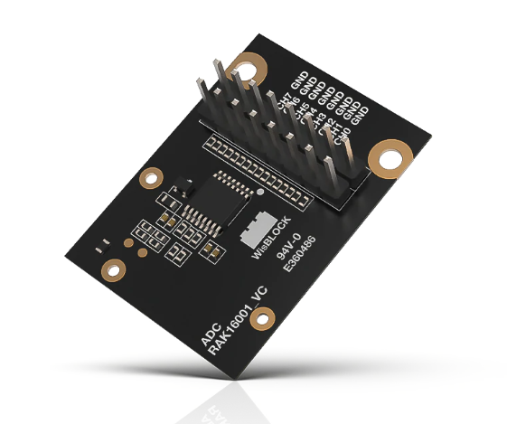
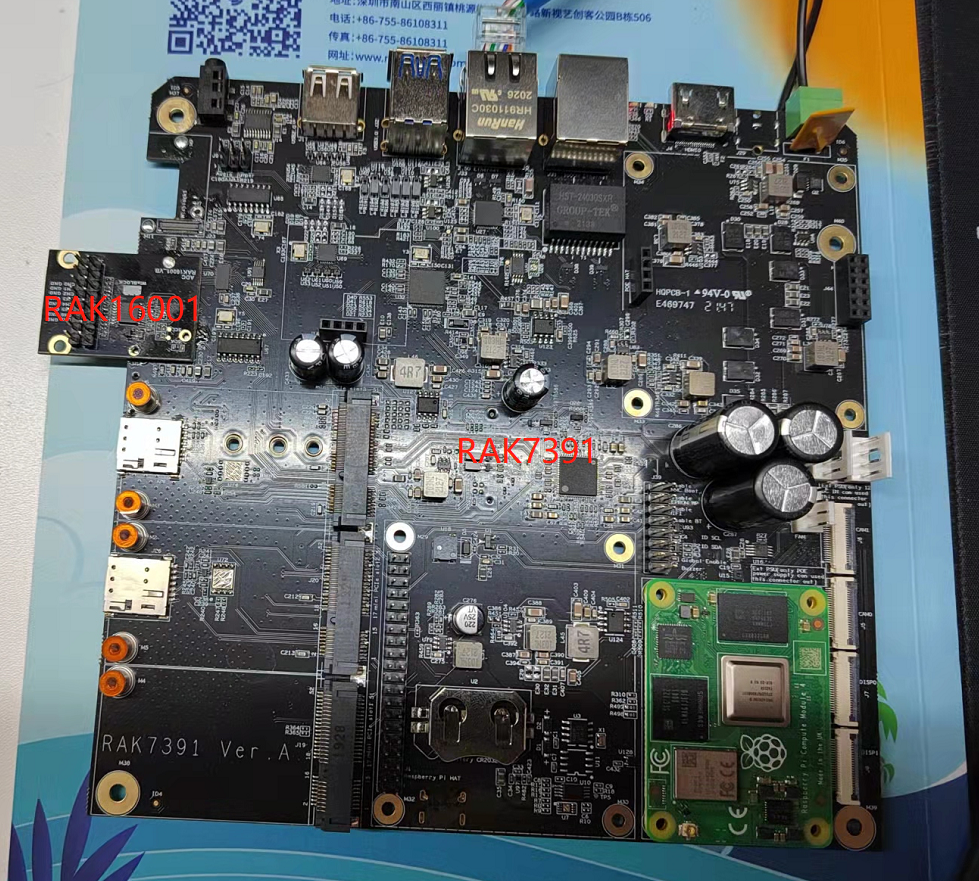
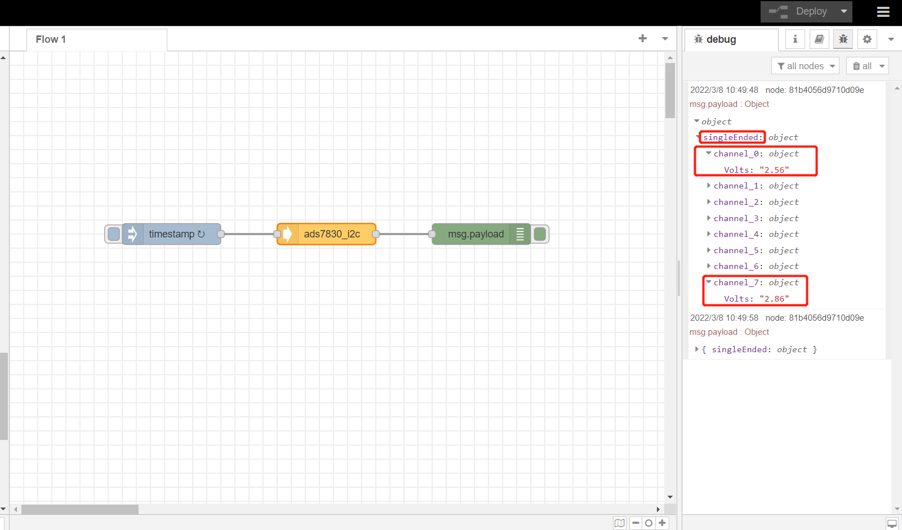

# Extend RAK16001 in RAK7391 board and test it with NodeRed

## 1. Introduction

This guide explains how to create a flow and then use the node **node-red-contrib-ads7830** to read 8 channels of [rak16001](https://store.rakwireless.com/products/rak16001-wisblock-adc-module) every 5 seconds with single end mode. ADS7830 use `i2c-1` of RAK7391 board to add 8 single analog inputs or 4 differential analog input. 





## 2. Preparation

### 2.1. Hardware

We should attach the rak16001 to the wisblock expansion slot of rak7391 as shown below.




Then we connect rak16001 with a DC power supply as follows. A0 of rak16001 connect channel 1 of power suply device and A7 connects channel 2.


### 2.2. Software

Please install `node-red-contrib-ads7830` node with the following commands. If you use docker of Node-RED, you may need to replace `~/.node-red` with `/usr/src/node-red`.

```
git clone https://git.rak-internal.net/product-rd/gateway/wis-developer/rak7391/node-red-nodes.git
```

```
cp -rf node-red-nodes/node-red-contrib-ads7830 ~/.node-red/node_modules
```

```
cd ~/.node-red/node_modules/node-red-contrib-ads7830 && npm install
```

**Tips:**  After `node-red-contrib-ads7830`  installed,  **node-red should be restarted**, otherwise, the node cannot be found on the page.

## 3. Run example

Import the  [rak16001-read.json](rak16001-read.json) file ,  then the new flow should look like this:


Hit the **Deploy** button on the top right to deploy the flow.

This is a simple flow  contains three nodes, where inject node trigger input every 5 seconds,  ads7830_i2c read 8 channels input with single end mode, and debug node print the read result.

The result  is shown as below.




## 4. License

This project is licensed under MIT license.
