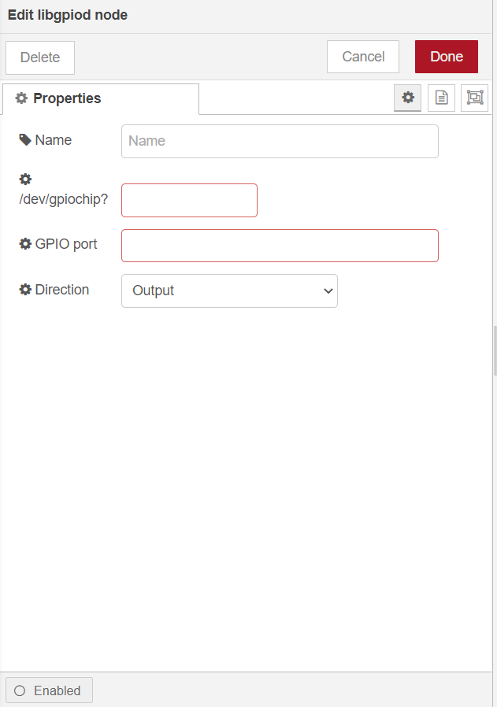
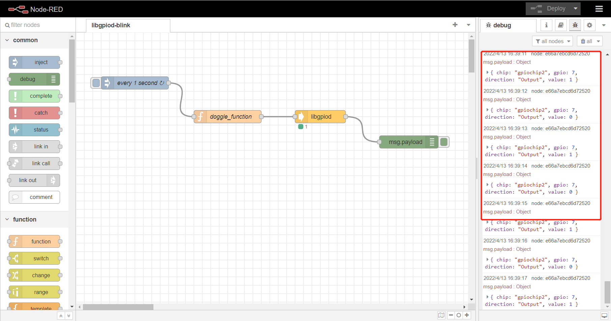

node-red-contrib-libgpiod
==================================

A node-red node providing access to gpiochip to set its gpio pin.

---

## Install

Install `libgpiod` library with the following commands. 

```
sudo apt install libgpiod
```

Install `node-red-contrib-libgpiod` node with the following commands. If you use docker of Node-RED, you may need to replace `~/.node-red` with `/usr/src/node-red`.

```
git clone -b dev https://git.rak-internal.net/product-rd/gateway/wis-developer/rak7391/node-red-nodes.git
```

```
cp -rf node-red-nodes/node-red-contrib-libgpiod ~/.node-red/node_modules
```

```
cd ~/.node-red/node_modules/node-red-contrib-libgpiod && npm install
```

**Tips:**  After `node-red-contrib-libgpiod` being installed,  **node-red should be restarted**, otherwise, the node cannot be found on the page.

## Usage

To set  GPIO port of `/dev/gpiochip?` you just need to select the correct settings for your device and trigger the node. 

	

- **Name**

  Define the msg name if you wish to change the name displayed on the node.

- **/dev/gpiochip?**

  The gpiochip Device # - You can execute 'sudo gpiodetect' to see gpiochip num.

- **GPIO port**

  The port of selected gpiochip must be number.
  
- **Direction**

  The direction of port can be set as `input` or `output` mode.


## Example

Copy the following JSON data to a file and rename file as nfc-read.json.

Import the json file to Node-RED then deploy the flow.

```
[
    {
        "id": "bced94699edbe2ef",
        "type": "tab",
        "label": "libgpiod-blink",
        "disabled": false,
        "info": "This is an example flow that toggle led on rak7391 status every 1 second.",
        "env": []
    },
    {
        "id": "db47e56206a2e391",
        "type": "libgpiod",
        "z": "bced94699edbe2ef",
        "name": "",
        "gpiochip_dev": "2",
        "gpio_port": "7",
        "gpio_direction": "1",
        "x": 580,
        "y": 200,
        "wires": [
            [
                "e66a7ebcd6d72520"
            ]
        ]
    },
    {
        "id": "e66a7ebcd6d72520",
        "type": "debug",
        "z": "bced94699edbe2ef",
        "name": "",
        "active": true,
        "tosidebar": true,
        "console": false,
        "tostatus": false,
        "complete": "false",
        "statusVal": "",
        "statusType": "auto",
        "x": 790,
        "y": 260,
        "wires": []
    },
    {
        "id": "d8aa272c8d7b18f9",
        "type": "inject",
        "z": "bced94699edbe2ef",
        "name": "every 1 second",
        "props": [
            {
                "p": "payload"
            },
            {
                "p": "topic",
                "vt": "str"
            }
        ],
        "repeat": "1",
        "crontab": "",
        "once": false,
        "onceDelay": 0.1,
        "topic": "",
        "payload": "",
        "payloadType": "date",
        "x": 140,
        "y": 120,
        "wires": [
            [
                "9fd77fac1c624157"
            ]
        ]
    },
    {
        "id": "9fd77fac1c624157",
        "type": "function",
        "z": "bced94699edbe2ef",
        "name": "doggle_function",
        "func": "var count = context.get('count') || 0;\nmsg.payload = 1 - count;\ncontext.set('count', msg.payload);\n\nreturn msg;\n",
        "outputs": 1,
        "noerr": 0,
        "initialize": "",
        "finalize": "",
        "libs": [],
        "x": 360,
        "y": 200,
        "wires": [
            [
                "db47e56206a2e391"
            ]
        ]
    }
]
```

After deploy, we can find LED on board blinks. 



This project is licensed under MIT license.
