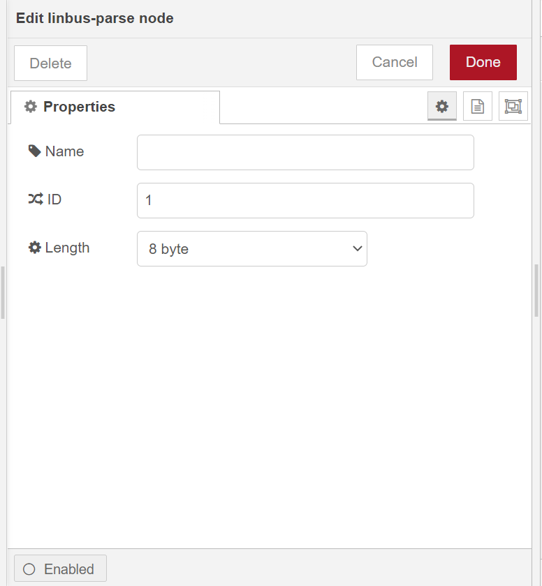
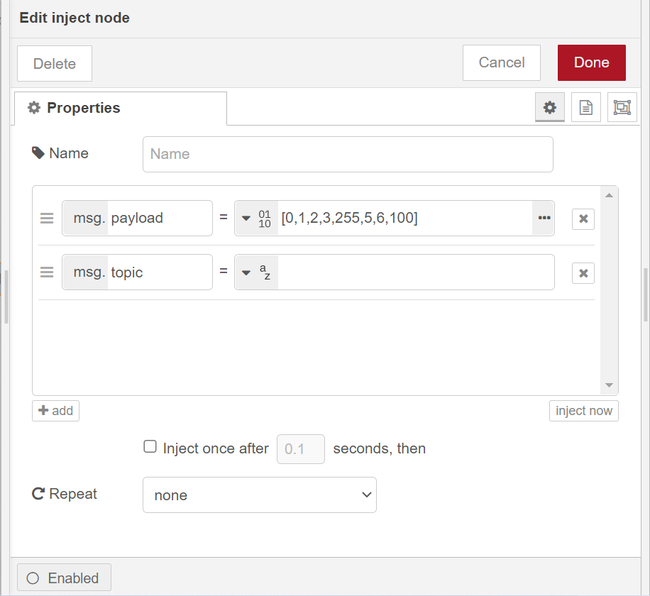

# node-red-contrib-linbus

A node-red-contrib-linbus module is able to parse and create LinBUS-compatible frames to be forwarded using a serial connection.

---

## Install

Please follow the steps below to install the  `node-red-contrib-linbus` module.

first, you need download the source code of this module from our `node-red-nodes` repository

```
git clone -b dev https://git.rak-internal.net/product-rd/gateway/wis-developer/rak7391/node-red-nodes.git
```

you should copy `node-red-contrib-linbus` folder to  `node_modules` folder,  which is in the root directory of your node-red install

```
cp -rf node-red-nodes/node-red-contrib-linbus ~/.node-red/node_modules
```

then go to the `node-red-contrib-linbus` folder  and run the installation command

```
cd ~/.node-red/node_modules/node-red-contrib-linbus && npm install
```

**Note:**  You must restart node-red service then you can find linbus nodes  on the left of editor window.

## Usage

`node-red-contrib-linbus` has two nodes,  `linbus-parse` node and `linbus-builder` node.  they  need to be used in combination with a serial port node, you must install `node-red-node-serialport` module first

### linbus-parse

`linbus-parse` node that will receive data from a serial node and output a message upon valid linbus message reception (including frame ID, length and raw data a a byte buffer). in this node you must config `ID` and `Length` options.



**ID:**Specify the identifier of linbus frame that you want to parse. values in the range 0 to 63 can be used.

**Length:**Specify the data length of linbus frame that you want to parse. data length should be 2 bytes or 4 bytes or 8 bytes

### linbus-builder

linbus-builder` node that will create a valid linbus frame from a frame ID and a byte buffer payload, the output will be fed to a serial node. 

In this node you must config `ID`option, which specify the identifier of linbus frame that you want to builder. values in the range 0 to 63 can be used. 


the payload is generated with an `inject` node, one thing to note is that the payload type must be set to `buffer` in the `inject` node and data length should be 2 bytes or 4 bytes or 8 bytes.




## License

This project is licensed under MIT license.
