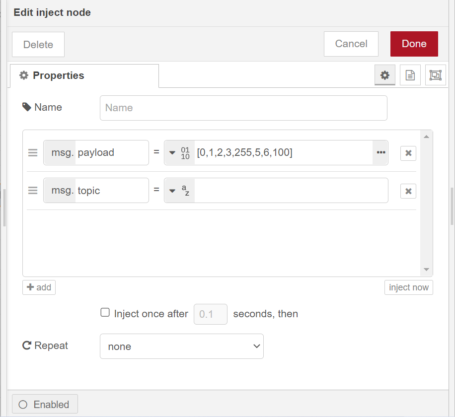

# LinBUS communication using WisBlock LIN MODULE RAK13005 on RAK7391

## 1.Introduction

This guide explains how to use the [RAK13005](https://docs.rakwireless.com/Product-Categories/WisBlock/RAK13005/Overview/) in combination with RAK7391 WisGate Developer Connect to interface a linBUS device using node-red.

### 1.1 linBUS protocol

**LIN** (**Local Interconnect Network**) is a [serial](https://en.wikipedia.org/wiki/Serial_communication) [network protocol](https://en.wikipedia.org/wiki/Network_protocol) used for communication between components in vehicles. It is a single wire, serial network protocol that supports communications up to 19.2 Kbit/s at a bus length of 40 meters. 

### 1.2. RAK13005

The RAK13005 is a **Local Interconnect Network** (LIN) transceiver module, used in automatic technologies that can be mounted on the IO slot of the WisBlock Base board. It is designed for in-vehicle networks using data transmission rates from 2.4 kBaud to 20 kBaud, and it uses the TLE7259-3 chip from Infineon.

## 2. Preparation

### 2.1. Hardware

In this example we will establish a linBus communication between WisBlock Starter Kit and RAK7391 WisGate Developer Connect with two RAK13005 modules, so we need: 

- **RAK7391 WisGate Developer Connect**

- **WisBlock Starter Kit** (WisBlock Base RAK5005-O + WisBlock Core RAK4631)


- **RAK13005** 


- **Other hardware**

​		We will need a couple of cables to connect both RAK13005 modules and an external 5-27v power supply  to RAK13005 modules.

The connection diagram should be like this.


### 2.2. Software

- **node-red-contrib-linbus**

Install the `node-red-contrib-linbus` moulde from our node-red-nodes repository , 

```plaintext
git clone -b dev https://git.rak-internal.net/product-rd/gateway/wis-developer/rak7391/node-red-nodes.git
```

copy `node-red-contrib-linbus` folder to  `node_modules` folder, `node_modules`  folder is located in the root directory of your node-red install.

```plaintext
cp -rf node-red-nodes/node-red-contrib-linbus ~/.node-red/node_modules
```

then go to the `node-red-contrib-linbus` folder  and run the installation command

```plaintext
cd ~/.node-red/node_modules/node-red-contrib-linbus && npm install
```

- **node-red-node-serialport**

In our flows, `node-red-contrib-linbus`  is used in combination with a serial port node, so we need to install`node-red-node-serialport` , run the following command in the root directory of your node-red install

```
npm install node-red-node-serialport@0.15.0 
```

**Note:** the latest version of node-red-node-serialport is `1.0.1`, but it has a serious bugs in a node-red container, so we use old version `0.15.0`.

## 3. Run example

In this example, we use `node-red-contrib-linbus` module to cerate node-red flows. there are two nodes in this module,  so we have two flows:

-  [linbus-parse-flow](linbus-parse-example.json) use `linbus-parse` node to receive linbus data from a serial node and and output a message upon valid LinBUS message reception.
-  [linbus-builder-flow](linbus-builder-example.json) use `linbus-builder` node to create a valid linbus frame from a frame type and a byte buffer payload, the output will be fed to a serial node.

We use [linbus-builder-flow](linbus-builder-example.json) as a example.  Import the flow,  then the new flow should look like this:


the payload is generated with an `inject` node, one thing to note is that the payload type must be set to `buffer` in the `inject` node and data length should be 2 bytes or 4 bytes or 8 bytes.



Hit the `Deploy` button on the top right to deploy this flow.

Here we use WisBlock Starter Kit as a slaver the slaver to receive linBUS data.  Arduino sketch can be found under the  [rak13005_linbus_device](rak13005_linbus_device/rak13005_linbus_slaver.ino) folder, compile and upload it into device, and open the Serial Monitor on the Arduino IDE. 

Then click `inject` node of flow,  we can see the serial output as follows. 


## 4. License

This project is licensed under MIT license.

