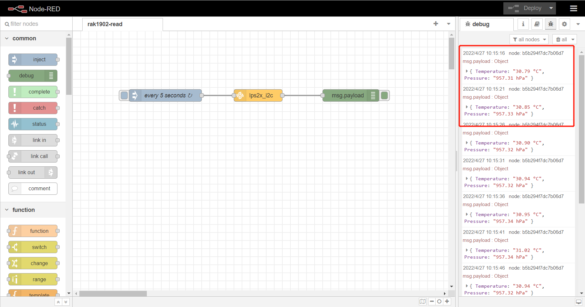

node-red-contrib-lps2x
==================================

A node-red node providing access to lps22hb or lps25hb I2C barometer sensor.

---

## Install

Please install `node-red-contrib-lps2x` node with the following commands. If you use docker of Node-RED, you may need to replace `~/.node-red` with `/usr/src/node-red`.

```
git clone -b dev https://git.rak-internal.net/product-rd/gateway/wis-developer/rak7391/node-red-nodes.git
```

```
cp -rf node-red-nodes/node-red-contrib-lps2x ~/.node-red/node_modules
```

```
cd ~/.node-red/node_modules/node-red-contrib-lps2x && npm install
```

**Tips:**  After `node-red-contrib-lps2x`  installed,  **node-red should be restarted**, otherwise, the node cannot be found on the page.

## Usage

To get barometer  you just need to select the correct settings for your device and trigger the node.

	

- **Name**

  Define the node name if you wish to change the name displayed on the node.

- **/dev/i2c-?**

  Default I2C Bus is 1.  `1` is for `/dev/i2c-1`.

- **Chip**

  You can select `LPS22HB` or `LPS25HB`.

- **i2c_Address**

  The Address for LPS2x is 0x5C or 0x5D. 


## Example

Copy the following JSON data to a file and rename file as rak1902-read.json. Import the json file to Node-RED then deploy the flow. Please note that the example use `LPS22HB` sensor with `0x5C` address. You can modified them before deploy.

```
[
    {
        "id": "db0801564df579c8",
        "type": "tab",
        "label": "rak1902-read",
        "disabled": false,
        "info": "",
        "env": []
    },
    {
        "id": "819eab5b7d1ab70a",
        "type": "lps2x_i2c",
        "z": "db0801564df579c8",
        "name": "",
        "i2c_device_number": 1,
        "chip": "0",
        "i2c_address": "0x5C",
        "x": 460,
        "y": 160,
        "wires": [
            [
                "b5b294f7dc7b06d7"
            ]
        ]
    },
    {
        "id": "4a1cc7d7c5630ff2",
        "type": "inject",
        "z": "db0801564df579c8",
        "name": "every 5 seconds",
        "props": [
            {
                "p": "payload"
            },
            {
                "p": "topic",
                "vt": "str"
            }
        ],
        "repeat": "5",
        "crontab": "",
        "once": false,
        "onceDelay": 0.1,
        "topic": "",
        "payload": "",
        "payloadType": "date",
        "x": 230,
        "y": 160,
        "wires": [
            [
                "819eab5b7d1ab70a"
            ]
        ]
    },
    {
        "id": "b5b294f7dc7b06d7",
        "type": "debug",
        "z": "db0801564df579c8",
        "name": "",
        "active": true,
        "tosidebar": true,
        "console": false,
        "tostatus": false,
        "complete": "false",
        "statusVal": "",
        "statusType": "auto",
        "x": 690,
        "y": 160,
        "wires": []
    }
]
```

After deploy, we can get data of barometer  as follows. 



## License

This project is licensed under MIT license.
