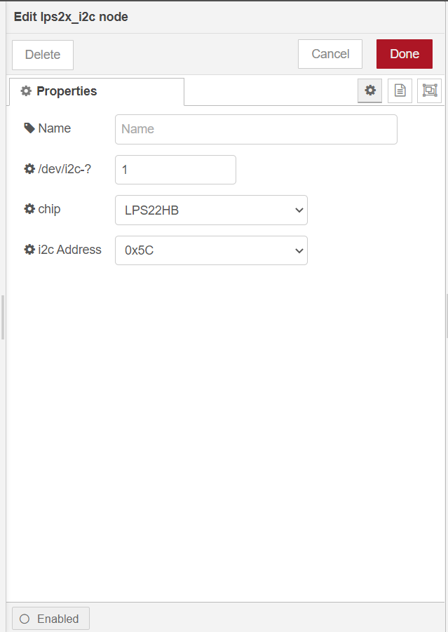

# @rakwireless/lps2x

Node-RED node providing access to lps22hb and lps25hb I2C barometer sensors.

[](https://www.npmjs.com/package/@rakwireless/lps2x)
[](https://www.npmjs.com/package/@rakwireless/lps2x)

## Install from Node-RED

From within NodeRED, visit the top right menu, select `Manage palette` and then the `Install` tab. Look for `@rakwireless/lps2x` and install it.


## Manual installation (development)

Please install `@rakwireless/lps2x` node with the following commands. If you use docker of Node-RED, you may need to replace `~/.node-red` with `/usr/src/node-red`.

```
git clone https://github.com/RAKWireless/node-red-nodes.git
```

```
cp -rf node-red-nodes/node-red-contrib-lps2x ~/.node-red/node_modules
```

```
cd ~/.node-red/node_modules/node-red-contrib-lps2x && npm install
```

**Tips:**  After `@rakwireless/lps2x`  installed,  **Node-RED should be restarted**, otherwise, the node cannot be found on the page.

## Usage

To get barometer  you just need to select the correct settings for your device and trigger the node.

	

- **Name**

  Define the node name if you wish to change the name displayed on the node.

- **/dev/i2c-?**

  Default I2C Bus is 1.  `1` is for `/dev/i2c-1`.

- **Chip**

  You can select `LPS22HB` or `LPS25HB`.

- **i2c_Address**

  The Address for LPS2x is 0x5C or 0x5D. 


## Examples

[rak1902-read](https://github.com/RAKWireless/node-red-nodes/tree/master/node-red-contrib-lps2x/examples/rak1902-read) - Read sensor data from RAK1902 every 5 seconds.

## License

This project is licensed under MIT license.
