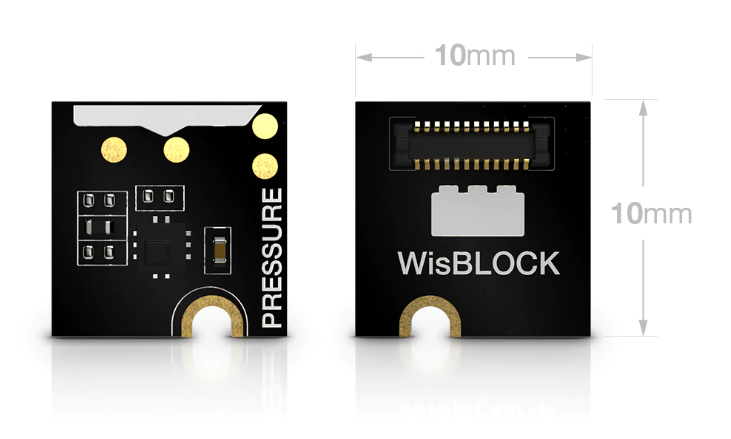
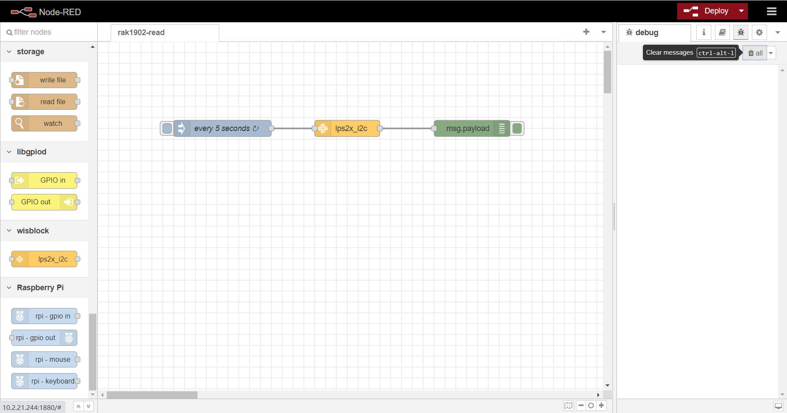

# Use RAK1902 barometer sensor with RAK7391 board and RAK6421 Pi-Hat from NodeRED

## 1. Introduction

This guide explains how to create a flow and then use the node **node-red-contrib-lps2x** to read the data from RAK1902 barometer  sensor with RAK7391 board and RAK6421 Pi-Hat. 

RAK1902 uses `i2c-1` of RAK7391 board.  

### 1.1 Requirements

You need to ensure that the user of system has I2C operation permission.


## 2. Preparation

### 2.1. Hardware

#### 2.1.1. Sensor hardware

WisBlock sensor RAK1902 uses the LPS22HB barometer sensor.



 

#### 2.1.2.  RAK6421 Pi-Hat

RAK6421 is a pi-hat  for Raspberry pi 3B/4B or RAK7391 which has 4 sensor slots and 2 IO slots of Wisblock. 


#### 2.1.3. Connection diagram

Firstly, connect RAK1902  to RAK6421 board. And then connect RAK6421 to RAK7391.


We can also connect RAK6421 to Raspberry pi 4B+.

### 2.2. Software

Please install `node-red-contrib-lps2x` node with the following commands. If you use docker of Node-RED, you may need to replace `~/.node-red` with `/usr/src/node-red`.

```
git clone https://git.rak-internal.net/product-rd/gateway/wis-developer/rak7391/node-red-nodes.git
```

```
cp -rf node-red-nodes/node-red-contrib-lps2x ~/.node-red/node_modules
```

```
cd ~/.node-red/node_modules/node-red-contrib-lps2x && npm install
```

**Tips:**  After `node-red-contrib-lps2x`  installed,  **node-red should be restarted**, otherwise, the node cannot be found on the page.

## 3. Run example

We can also import the  **rak1902-read.json** file or just copy and paste the .json file contents into your new flow directly.

After the import is done, the new flow should look like this:



Hit the **Deploy** button on the top right to deploy the flow.

This is a simple flow with three node, where`lps2x_i2c` read RAK1902 sensor data ,  `inject` node trigger RAK1902  to get data every 5 seconds and `debug` node print the sensor data read from RAK1902 sensor.

The result is as follows:


## 4. License

This project is licensed under MIT license.
