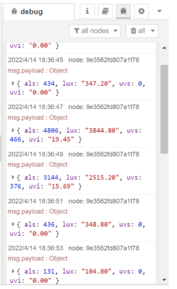

# node-red-contrib-ltr-390uv

A node providing access to ltr-390uv, measuring and calculating lux and uvi(ultraviolet index).  

**Tips**: Please make sure that user has the permissions to access i2c devices, otherwise user can not read from the ltr-390uv chip. 

---

## Install

Please install `node-red-contrib-ltr-390uv` node with the following commands. If you use docker of Node-RED, you may need to replace `~/.node-red` with `/usr/src/node-red`,

```
git clone https://git.rak-internal.net/product-rd/gateway/wis-developer/rak7391/node-red-nodes.git
```

then copy `node-red-contrib-ltr-390uv` directory  to  the `node_modules` directory,

```
cp -rf node-red-nodes/node-red-contrib-ltr-390uv ~/.node-red/node_modules
```

lastly, change to the `node-red-contrib-ltr-390uv` directory and install the node, 

```
cd ~/.node-red/node_modules/node-red-contrib-ltr-390uv && npm install
```

**Tips:**  After the installation of  `node-red-contrib-ltr-390uv`  is finished, please restart your node-red service.  Otherwise, the node cannot be found/added to the new flow.

## Usage

To get the lux and uvi reading from the ltr-390uv,  you need to select the correct setting for `node-red-contrib-ltr-390uv` node.


**Name**

Define the msg name if you wish to change the name displayed on the node.

**/dev/i2c-?**

The i2c bus number, the default value is `1` , it means `'/dev/i2c-1'`.

**i2c_Address**

The i2c slave address for the ltr-390uv, by default is set to `0x53`.

**gain**

Define the als/uvs measuring gain range. the default value is `1x`

**resolution**

Define the als/uvs measuring resolution, the default value is `16 Bit`


The output of the node is a payload contains the raw als data, raw uvs data,  the calculated lux and the calculated uvi.




## Examples

- [rak12019-reading](examples/rak12019-reading/README.md) - Measure lux and uvi using WisBlock UV sensor RAK12019 from Node-RED.


## License

This project is licensed under MIT license.
