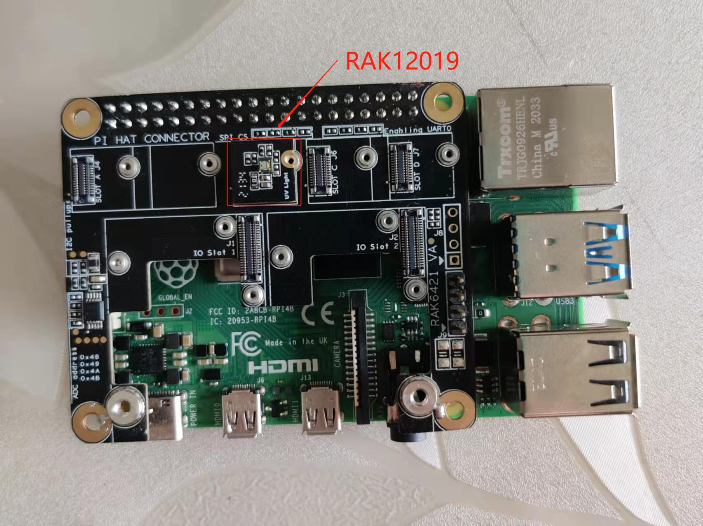
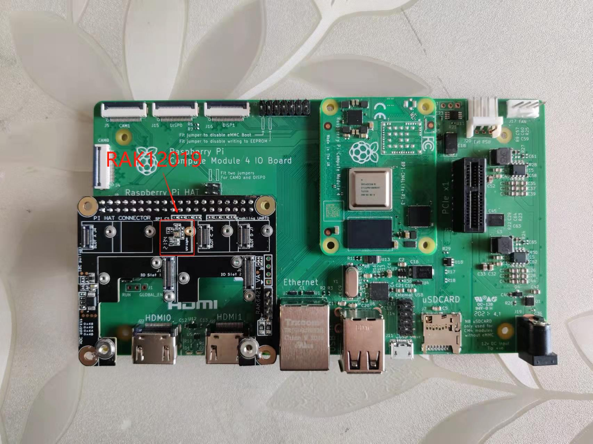
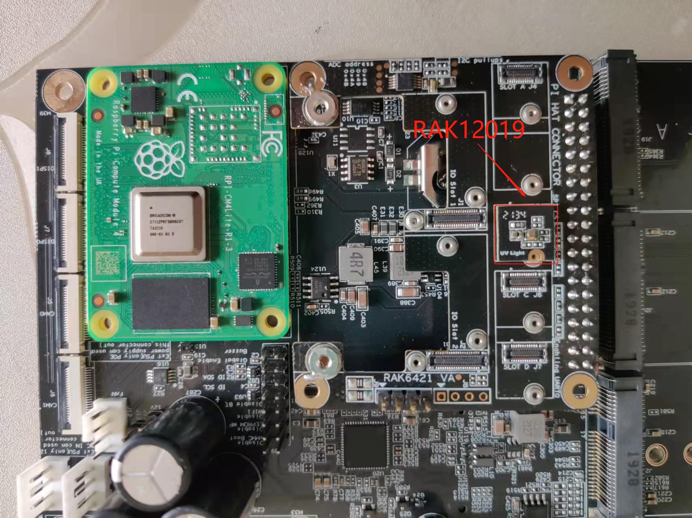
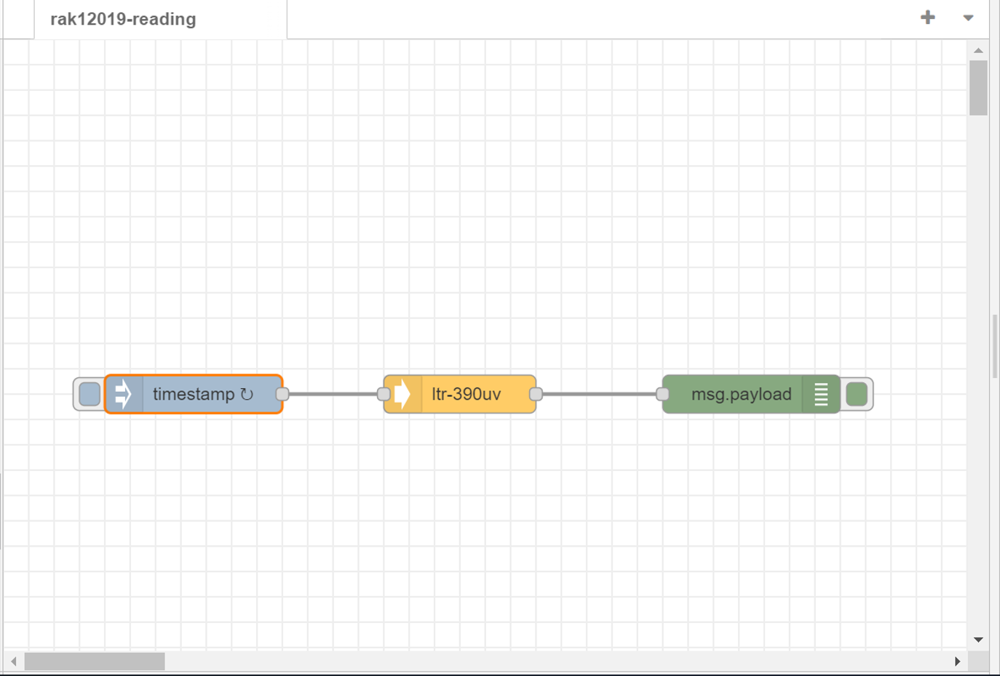

# Measure lux and uvi using WisBlock UV sensor RAK12019 from Node-RED 

## 1 Introduction

This guide explains how to use the [WisBlock UV Sensor RAK12019](https://docs.rakwireless.com/Product-Categories/WisBlock/RAK12019/Overview/) in combination with RAK6421 Wisblock Hat or RAK7391 WisGate Developer Connect to measure lux and uvi(ultraviolet index) through the I2C interface using Node-RED.  

### 1.1 RAK12019

The RAK12019 is an Ambient Light sensor (ALS) or Ultraviolet Light Sensor (UVS), which is part of the RAKwireless WisBlock sensor series. The measured ambient light intensity and ultraviolet index are interfaced via the I2C bus making it immune to electrical noises, unlike its analog output counterpart. This module utilizes the `LTR-390UV-01` sensor from Lite-On. For more information about RAK12019, refer to the [Datasheet](https://docs.rakwireless.com/Product-Categories/WisBlock/RAK12004/Datasheet/).

### 1.2 LTR-390UV-01

The LTR-390UV-01 is an integrated low voltage I2C  ambient aight sensor(ALS) and  ultraviolet light sensor(UVS) in a single miniature 2x2mm ChipLED lead-free surface mount package. This sensor converts light intensity to a digital output signal capable of direct I2C interface. For more information about LTR-390UV-01, refer to the [Datasheet](https://optoelectronics.liteon.com/upload/download/DS86-2015-0004/LTR-390UV_Final_%20DS_V1%201.pdf). 

## 2 Preparation

### 2.1 Hardware

The easiest way to set up the hardware is to use the RAK6421 WisBlock Hat that exposes all the Wisblock high-density connector pins.  The RAK12019 can be mounted to the HAT, and the HAT goes to the 40-pin headers located on Raspberry Pi 4B/IO board/RAK7391. Based on your hardware selections, there are three ways to mount RAK12019:

- **Raspberry Pi model B + RAK6421 WisBlock Hat +  RAK12019**

   

- **Raspberry Pi CM4 + Compute Module 4 IO Board + RAK6421 WisBlock Hat + RAK12019**

   

- **Raspberry Pi CM4  + RAK7391 WisGate Developer Connect + RAK6421 WisBlock Hat + RAK12019**

   


### 2.2 Software 

While the `node-red-contrib-ltr-390uv` hasn't been published, so you need to install it from our gitlib repository. Please install `node-red-contrib-ltr` node with the following commands. If you are using docker for Node-RED, you may need to replace `~/.node-red` with `/usr/src/node-red`,

```
git clone https://git.rak-internal.net/product-rd/gateway/wis-developer/rak7391/node-red-nodes.git
```

then copy `node-red-contrib-ltr-390uv directory  to  the `node_modules directory,

```
cp -rf node-red-nodes/node-red-contrib-ltr-390uv ~/.node-red/node_modules
```

lastly, change to the `node-red-contrib-ltr-390uv` directory and install the node, 

```
cd ~/.node-red/node_modules/node-red-contrib-ltr-390uv && npm install
```

**Tips:**  After the installation of  `node-red-contrib-ltr-390uv`  is finished, please restart your node-red service/container(s).  Otherwise, the node cannot be found/added to the new flow.


## 3 Run examples

Import  [**rak12019-reading.json**](rak12019-reading.json) flow,  then the new flow should look like this:




This flow outputs the measuring result with `debug` node every 2 seconds, the output of the node is a payload contains the raw als data, raw uvs data,  the calculated lux and the calculated uvi.


## 4 License

This project is licensed under MIT license.
