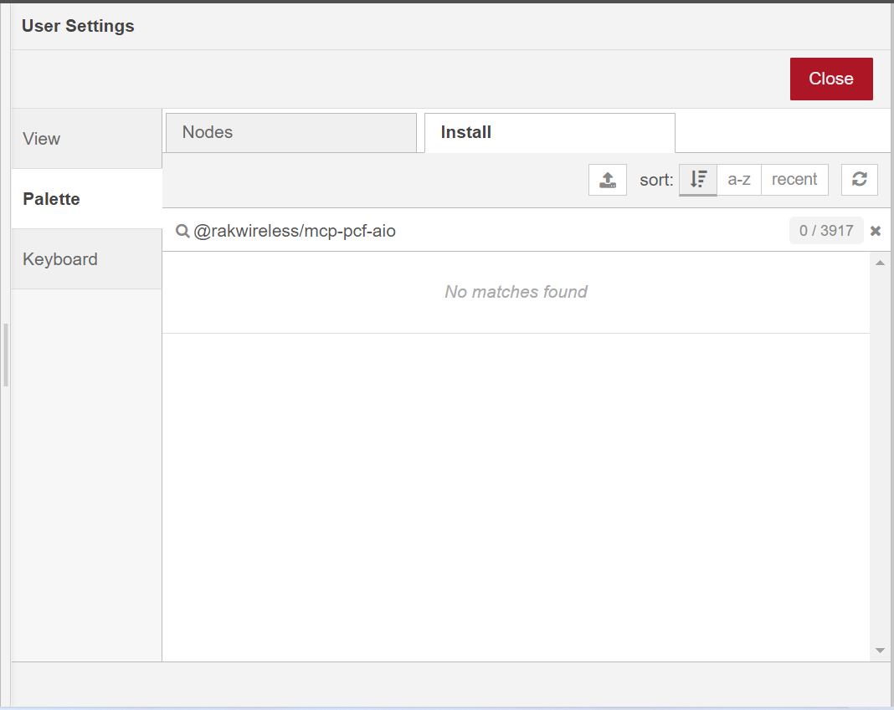
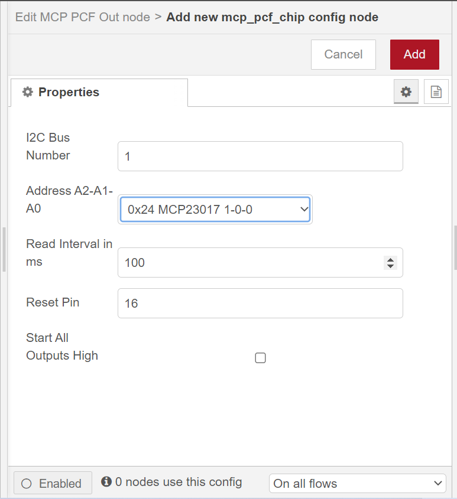

# @rakwireless/mcp-pcf-aio

A Node-Red node for 16-Bit I/O Expander MCP23017 chip and 8-Bit I/O Expander PCF8574 chip.

## Install from Node-RED

From within NodeRED, visit the top right menu, select `Manage palette` and then the `Install` tab. Look for `@rakwireless/mcp-pcf-aio` and install it.




## Manual installation (development)

@rakwireless/mcp-pcf-aio will be published to the Node-RED Library by [RAKwireless](https://www.rakwireless.com/en-us), then you can run the following command in the root directory of your node-red install:

```
npm install @rakwireless/mcp-pcf-aio
```


## Usage

**NOTE**: Please make sure that Node-RED user has the permissions to access I2C devices if you deploy Node-red with docker.

There is a global (hidden) `MCP-PCF-chip` node you can set, with following options:

**I2C bus Number:** the I2C bus number for the IO expander chip

**Address A2-A1-A0:**  the IO expander chip and the i2c bus address

**Interval:** is used to determine how frequently all inputs are polled

**Reset Pin:** GPIO number of reset pin, only used for reset MCP23017 chip  

**Start All Outputs High:** Some relay boards turn OFF if sending HIGH signal from the chip. To prevent accidentally turn ON all the realays on startup, use this checkbox.




**NOTE:**  The original version of [mcp-pcf-aio](https://flows.nodered.org/node/@pizzaprogram/mcp-pcf-aio)  is published by László Szakmári and we made some changes based on it to set RESET pin for MCP23017 chip.


## Example

[mcp-pcf-aio-examle.json](https://github.com/RAKWireless/node-red-nodes/blob/master/node-red-contrib-mcp-pcf-aio/examples/mcp-pcf-aio-examle.json)  - The example shows how to Control LED using [RAK14003 WisBlock LED Bar Graph Module](https://docs.rakwireless.com/Product-Categories/WisBlock/RAK14003/Overview/).


## License

This project is licensed under MIT license.
