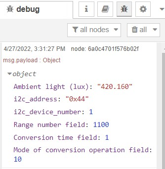

# node-red-contrib-opt3001

The node-red-contrib-opt3001 node allows users to read inputs of TI OPT3001DNPR ambient light sensor, and leverage this node to build up an ambient light data acquisition system.

**Tips**: Please make sure that user has the permissions to access i2c devices, otherwise user can neither enable the opt3001 chip nor read from the chip. 

---

## Install

Please install `node-red-contrib-opt3001` node with the following commands. If you use docker of Node-RED, you may need to replace `~/.node-red` with `/usr/src/node-red`,

```
git clone -b dev https://git.rak-internal.net/product-rd/gateway/wis-developer/rak7391/node-red-nodes.git
```

then copy `node-red-contrib-opt3001` directory  to  the `node_modules` directory,

```
cp -rf node-red-nodes/node-red-contrib-opt3001 ~/.node-red/node_modules
```

lastly, change to the `node-red-contrib-3001` directory and install the node, 

```
cd ~/.node-red/node_modules/node-red-contrib-opt3001 && npm install
```

**Tips:**  After the installation of  `node-red-contrib-opt3001`  is finished, please restart your node-red service.  Otherwise, the node cannot be found/added to the new flow.

## Usage

To get the ambient light readings from opt3001, users need to define the i2c bus of the chip first. In this case, opt3001 is on bus 1, and the I2C address is configured to 0x44. Based on [OPT3001's datasheet](https://www.ti.com/lit/ds/symlink/opt3001.pdf?ts=1650948147469&ref_url=https%253A%252F%252Fwww.google.com%252F), this chip has four possible I2C address based on the ADDR pin configuration, which are 0x44, 0x45, 0x46, and 0x47. Users also need to set the scale mode, conversion time, and conversion operation mode based on their own use cases.


The output of the node is a payload contains the ambient light reading, the I2C address (in hexecimal), the I2C device number (bus number), range number field, conversion time field, and mode of conversion operation mode.  



**Name**

Define the msg name if you wish to change the name displayed on the node.

**/dev/i2c-?**

Default I2C Bus is 1.  `1` is for `'/dev/i2c-1'`.

**i2c_Address**

The Address by default is set to `0x44`, this is the I2C address of RAK1903, which is based on opt3001 ambient light sensor. 

**Scale Mode**

The option "Scale Mode" is for users to configure the scale range, according to [opt3001's datasheet](https://www.ti.com/lit/ds/symlink/opt3001.pdf?ts=1650948147469&ref_url=https%253A%252F%252Fwww.google.com%252F), "the OPT3001 has an automatic full-scale-range setting mode that eliminates the need for a user to predict and set the optimal range for the device. This mode is entered when the configuration register range number field (RN[3:0]) is set to 0b1100." In this node, automatic full-scale mode is enabled by default. Other possible value for this options are 0b1101, 0b1110, and 0b1111, they are reserved for future use. 

**Conversion Time**

The option "Conversion Time" controls "the length of the light to digital conversion process. The choices are 100 ms and 800 ms. A longer integration time allows for a lower noise measurement", based on  [opt3001's datasheet](https://www.ti.com/lit/ds/symlink/opt3001.pdf?ts=1650948147469&ref_url=https%253A%252F%252Fwww.google.com%252F). When the conversion time field is set to 0, the conversion time is set to 100 ms; when the conversion time is set to 1, the conversion time is set to 800 ms.

**Conversion Operation Mode**

The option "Conversion Operation Mode" options allows users to controls whether the device is operating in continuous conversion, single-shot, or low-power shutdown mode. According to [opt3001's datasheet](https://www.ti.com/lit/ds/symlink/opt3001.pdf?ts=1650948147469&ref_url=https%253A%252F%252Fwww.google.com%252F), in shutdown mode, upon power-up, the device only consumes operational level power after appropriately programming the device; while in single-shot mode, the mode of conversion operation field continues to read 0b01 when the device is actively converting.

For more information about opt3001's configuration register fields description, please check Table 10 in the [datasheet](https://www.ti.com/lit/ds/symlink/opt3001.pdf?ts=1650948147469&ref_url=https%253A%252F%252Fwww.google.com%252F).


## Example

Once your installed the node in Node-RED, copy the content of the following .json file and paste it to the Clipboard in Node-RED, or you can download the .json file and import it. In this example, user can read ambient light readings every 1 second.

```
[
    {
        "id": "bced94699edbe2ef",
        "type": "tab",
        "label": "opt3001 example",
        "disabled": false,
        "info": "This is an example flow that read from opt3001 every 1 second.",
        "env": []
    },
    {
        "id": "2c60d9550d5105ce",
        "type": "opt3001",
        "z": "bced94699edbe2ef",
        "name": "",
        "i2c_device_number": 1,
        "i2c_address": "0x44",
        "rangeNumber": "1100",
        "conversionTime": "1",
        "conversionMode": "10",
        "x": 320,
        "y": 80,
        "wires": [
            [
                "6a0c4701f576b02f"
            ]
        ]
    },
    {
        "id": "6a0c4701f576b02f",
        "type": "debug",
        "z": "bced94699edbe2ef",
        "name": "",
        "active": false,
        "tosidebar": true,
        "console": false,
        "tostatus": false,
        "complete": "false",
        "statusVal": "",
        "statusType": "auto",
        "x": 490,
        "y": 80,
        "wires": []
    },
    {
        "id": "cd97c9e6b9760ce3",
        "type": "inject",
        "z": "bced94699edbe2ef",
        "name": "every 1 second",
        "props": [
            {
                "p": "payload"
            },
            {
                "p": "topic",
                "vt": "str"
            }
        ],
        "repeat": "1",
        "crontab": "",
        "once": false,
        "onceDelay": 0.1,
        "topic": "",
        "payload": "",
        "payloadType": "date",
        "x": 140,
        "y": 80,
        "wires": [
            [
                "2c60d9550d5105ce"
            ]
        ]
    }
]
```


## License

This project is licensed under MIT license.
