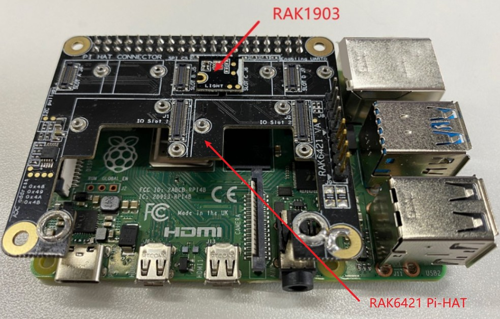
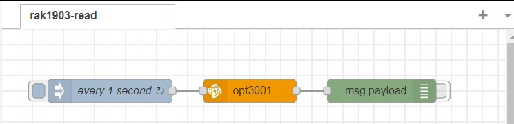
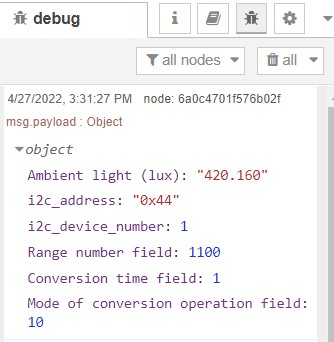

# Read ambient light using WisBlock sensor RAK1903 from Node-RED 

## 1 Introduction

This guide explains how to use the [RAK1903 WisBlock Ambient Light Sensor](https://docs.rakwireless.com/Product-Categories/WisBlock/RAK1903/Overview/#product-description) in combination with RAK6421 Wisblock Hat to do ambient light measuring.  

### 1.1 RAK1903

RAK1903 is a WisBlock Sensor which extends the WisBlock system with a [TI OPT3001DNPR light sensor](https://www.ti.com/product/OPT3001).  For more information about RAK1903, refer to the [Datasheet](https://docs.rakwireless.com/Product-Categories/WisBlock/RAK1903/Datasheet/).


## 2 Preparation

### 2.1 Hardware

The i2c address of RAK1903 is configured to 0x44, and connected to i2c bus 1. Please check opt3001's [datasheet](https://www.ti.com/lit/ds/symlink/opt3001.pdf?ts=1650948147469&ref_url=https%253A%252F%252Fwww.google.com%252F) for more information about how the device address is configured. 

The easiest way to set up the hardware is to use the RAK6421 WisBlock Hat that exposes all the Wisbock high-density connector pins.  The RAK1903 can be mounted to the HAT, and the HAT goes to the 40-pin headers located on Raspberry Pi 4B/IO board/RAK7391. Here is an example shows how RAK1903 is monted to the Pi-Hat on a Raspberry Pi model 4B :



### 2.2 Software

While the `node-red-contrib-opt3001` hasn't been published, so you need to install it in anther way. Please install `node-red-contrib-opt3001` node with the following commands. If you use docker of Node-RED, you may need to replace `~/.node-red` with `/usr/src/node-red`,

```
git clone -b dev https://git.rak-internal.net/product-rd/gateway/wis-developer/rak7391/node-red-nodes.git
```

then copy `node-red-contrib-opt3001` directory  to  the `node_modules` directory,

```
cp -rf node-red-nodes/node-red-contrib-opt3001 ~/.node-red/node_modules
```

lastly, change to the `node-red-contrib-3001` directory and install the node, 

```
cd ~/.node-red/node_modules/node-red-contrib-opt3001 && npm install
```

**Tips:**  After the installation of  `node-red-contrib-opt3001`  is finished, please restart your node-red service.  Otherwise, the node cannot be found/added to the new flow.

## 3 Run examples

Import  [**rak1903-read.json**](rak1903-read.json) flow, then the new flow should look like this:




The output of the node is a payload contains the ambient light reading, the I2C address (in hexecimal), the I2C device number (bus number), range number field, conversion time field, and mode of conversion operation mode.  




## 4 License

This project is licensed under MIT license.
