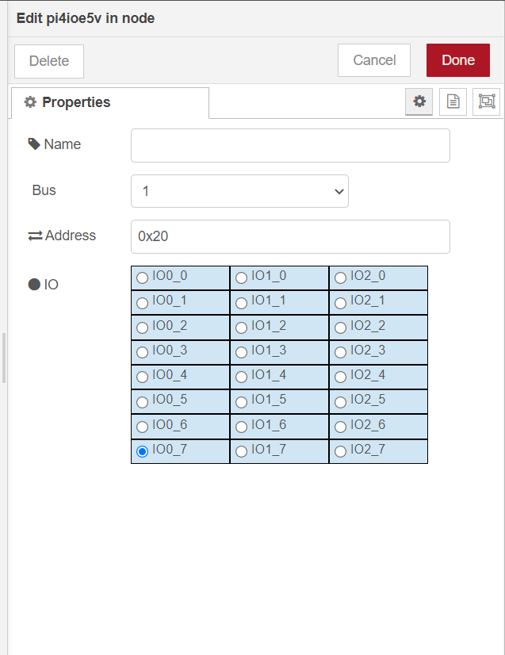
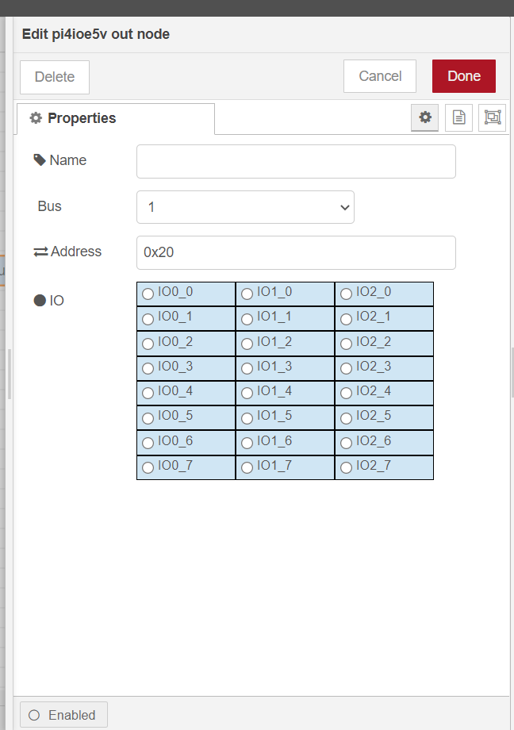

# node-red-contrib-pi4ioe5v

node-red-contrib-pi4ioe5v node is  IO expander Node-RED node running on raspberry pi.  Its chip is  PI4IOE5V96224 which can expand 24 IO pin with i2c interface.


**Tips**: Please make sure that user of system has the permissions to access i2c device, or  you cannot get  the result you want when use  pi4ioe5v node.

## Install

Please install `node-red-contrib-pi4ioe5v` node with the following commands. If you use docker of Node-RED, you may need to replace `~/.node-red` with `/usr/src/node-red`.

```
git clone -b dev https://git.rak-internal.net/product-rd/gateway/wis-developer/rak7391/node-red-nodes.git
```

```
cp -rf node-red-nodes/node-red-contrib-pi4ioe5v ~/.node-red/node_modules
```

```
cd ~/.node-red/node_modules/node-red-contrib-pi4ioe5v && npm install
```


## Usage

Provides two nodes - one to receive IO state, and one to set IO state.

### pi4ioe5v in

PI4IOE5VXXX IO expander input node. Generates a `msg.payload` with either a 0 or 1 depending on the state of the input pin.



- **Name**

  Define the msg name if you wish to change the name displayed on the node.

- **Bus**

  Default I2C Bus is 1.  `1` is for `'/dev/i2c-1'`.

- **Address**

  The Address by default is set to 0x20. You can setup the PI4IOE5V96224 address according to your hardware. Please see  PI4IOE5V96224 documentation for more information.

- **IO**

  Select one pin whose state you what get.


### pi4ioe5v out

PI4IOE5VXXX IO expander output node. Set specific IO pin as  0 or 1. 



- **Name**

  Define the msg name if you wish to change the name displayed on the node.

- **Bus**

  Default I2C Bus is 1.  `1` is for `'/dev/i2c-1'`.

- **Address**

  The Address by default is set to 0x20. You can setup the PI4IOE5V96224 address according to your hardware. Please see  PI4IOE5V96224 documentation for more information.

- **IO**

  Select one pin whose state you what set.


## Example

Copy next json to a file and rename file as pi4ioe5v-toggle-led.json.

Import the json file to Node-RED then deploy the flow.

```
[
    {
        "id": "d0f4ea7a6c4df086",
        "type": "tab",
        "label": "pi4ioe5v-toggle-led",
        "disabled": false,
        "info": "The example shows how to toggle the on-board LED in the RAK7391. LED on RAK7391 uses IO0_7 port of PI4IOE5V96224.",
        "env": []
    },
    {
        "id": "4ab926118dceef89",
        "type": "inject",
        "z": "d0f4ea7a6c4df086",
        "name": "",
        "props": [
            {
                "p": "payload"
            },
            {
                "p": "topic",
                "vt": "str"
            }
        ],
        "repeat": "5",
        "crontab": "",
        "once": false,
        "onceDelay": 0.1,
        "topic": "",
        "payload": "",
        "payloadType": "date",
        "x": 190,
        "y": 260,
        "wires": [
            [
                "c9debbfd7f22adbb"
            ]
        ]
    },
    {
        "id": "c9debbfd7f22adbb",
        "type": "pi4ioe5v in",
        "z": "d0f4ea7a6c4df086",
        "name": "",
        "bus": "1",
        "address": "0x20",
        "pin": "7",
        "x": 390,
        "y": 260,
        "wires": [
            [
                "6c60ba89b4984426"
            ]
        ]
    },
    {
        "id": "af19e4e92613bd7d",
        "type": "pi4ioe5v out",
        "z": "d0f4ea7a6c4df086",
        "name": "",
        "bus": "1",
        "address": "0x20",
        "pin": "7",
        "x": 790,
        "y": 260,
        "wires": []
    },
    {
        "id": "6c60ba89b4984426",
        "type": "function",
        "z": "d0f4ea7a6c4df086",
        "name": "toggle_led",
        "func": "let val = parseInt(msg.payload);\nif(val != 0 && val != 1) {\n    log.error('wrong value');\n} else {\n    msg.payload = 1 - msg.payload;\n}\n\nreturn msg;",
        "outputs": 1,
        "noerr": 0,
        "initialize": "",
        "finalize": "",
        "libs": [],
        "x": 590,
        "y": 260,
        "wires": [
            [
                "af19e4e92613bd7d"
            ]
        ]
    }
]
```

The example shows how to toggle the LED which connects to IO0_7 pin of PI4IOE5V96224.


## License

This project is licensed under MIT license.
