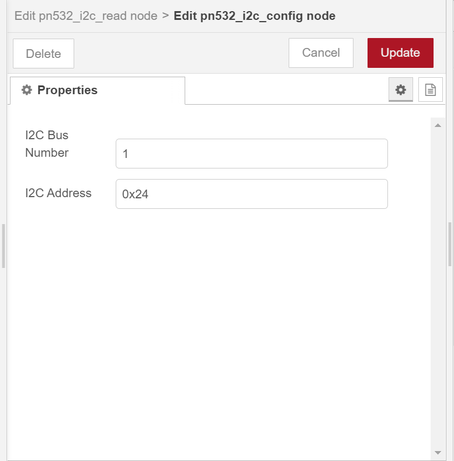
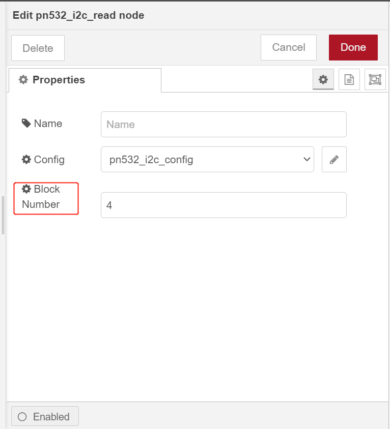
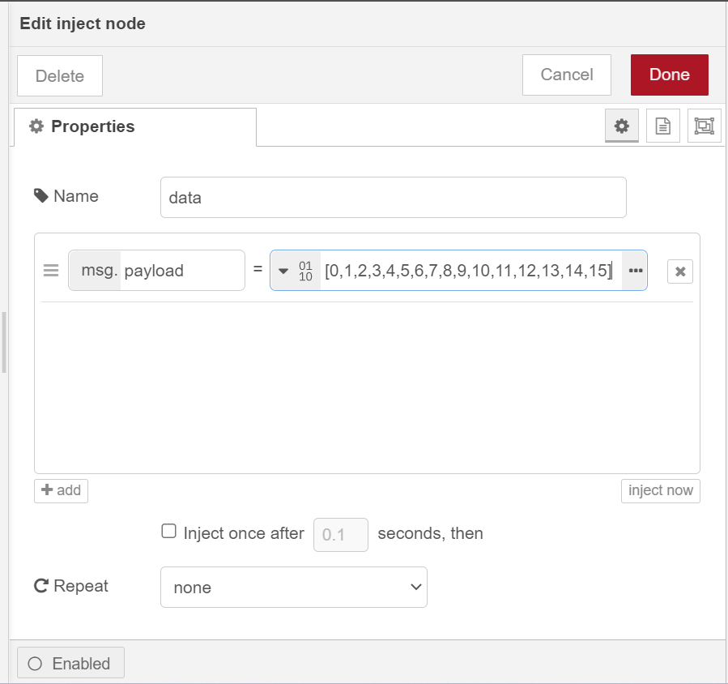

node-red-contrib-pn532-i2c
==================================

A node-red node providing access to PN532 module via an i2c connection, reading or writing the specified block data for a NFC/RFID card.

---

## Install

Please install `node-red-contrib-pn532-i2c` node with the following commands. If you install Node-RED in the docker, you may need to replace `~/.node-red` with `/usr/src/node-red`.

```
git clone https://git.rak-internal.net/product-rd/gateway/wis-developer/rak7391/node-red-nodes.git
```

```
cp -rf node-red-nodes/node-red-contrib-pn532-i2c ~/.node-red/node_modules
```

```
cd ~/.node-red/node_modules/node-red-contrib-pn532-i2c && npm install
```

**Tips:**  After `node-red-contrib-pn532-i2c` being installed,  **node-red should be restarted**, otherwise, the node cannot be found on the page.

## Usage

There is a `pn532_i2c-read` node and a `pn532_i2c_write` node, to read or write a NFC/RFID card from PN532 module,  you need to select the correct settings for the `pn532_i2c_config` node.



​	

- **I2C Bus Number**

  Default I2C bus number for pn532 is 1.  

- **I2C Address**

  Default I2C address for pn532 is 0x24. 

### Read a specified block data

To read a specific block data from a NFC/RFID card, you just need to set the `Block Number` option in the `pn532_i2c_read` node, then you can use a `inject` node to trigger it.




### Write a specified block data

To write a specific block data to a NFC/RFID card,  you need to set the `Block Number`  in the `pn532_i2c_write` node,  you also need to set the block data in the `inject` node. data must be a buffer of 16 bytes.



 


## Example

[rak13600-nfc-example](examples/rak13600-nfc/README.md)  - Read or write a NFC/RFID card by rak13600.


## License

This project is licensed under MIT license.
