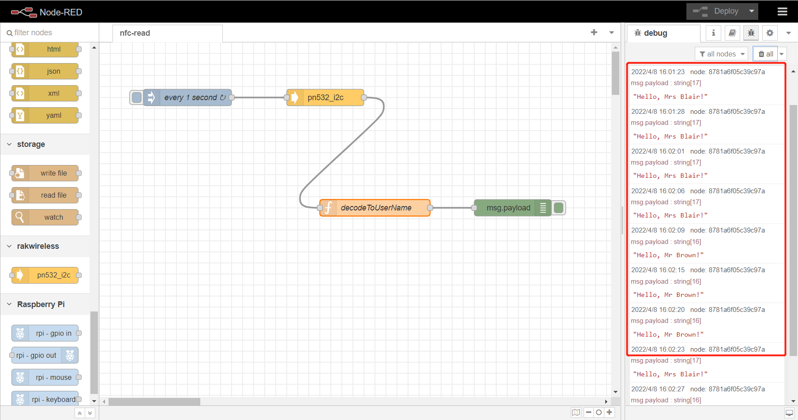

node-red-contrib-pn532-i2c
==================================

A node-red node providing access to PN532 to read UID of RFID card.

---

## Install

Please install `node-red-contrib-pn532-i2c` node with the following commands. If you use docker of Node-RED, you may need to replace `~/.node-red` with `/usr/src/node-red`.

```
git clone -b dev https://git.rak-internal.net/product-rd/gateway/wis-developer/rak7391/node-red-nodes.git
```

```
cp -rf node-red-nodes/node-red-contrib-pn532-i2c ~/.node-red/node_modules
```

```
cd ~/.node-red/node_modules/node-red-contrib-pn532-i2c && npm install
```

**Tips:**  After `node-red-contrib-pn532-i2c` being installed,  **node-red should be restarted**, otherwise, the node cannot be found on the page.

## Usage

To get  UID of RFID card from PN532 you just need to select the correct settings for your device and trigger the node.

	

- **Name**

  Define the msg name if you wish to change the name displayed on the node.

- **/dev/i2c-?**

  Default I2C Bus is 1.  `1` is for `'/dev/i2c-1'`.

- **i2c_Address**

  The Address for shtc3 is 0x24 which can not be changed. 


## Example

Copy the following JSON data to a file and rename file as nfc-read.json.

Import the json file to Node-RED then deploy the flow.

```
[
    {
        "id": "7f6c1fc22dd4c0ab",
        "type": "tab",
        "label": "nfc-read",
        "disabled": false,
        "info": "An example flow that will output a greeting to the card owner when a card is presented to the NFC reader. ",
        "env": []
    },
    {
        "id": "4682070011caf455",
        "type": "pn532_i2c",
        "z": "7f6c1fc22dd4c0ab",
        "name": "",
        "i2c_device_number": 1,
        "i2c_address": "0x24",
        "x": 410,
        "y": 100,
        "wires": [
            [
                "61a4028c595b3ec7"
            ]
        ]
    },
    {
        "id": "defa697bb78f6a0b",
        "type": "inject",
        "z": "7f6c1fc22dd4c0ab",
        "name": "every 1 second",
        "props": [
            {
                "p": "payload"
            },
            {
                "p": "topic",
                "vt": "str"
            }
        ],
        "repeat": "1",
        "crontab": "",
        "once": false,
        "onceDelay": 0.1,
        "topic": "",
        "payload": "",
        "payloadType": "date",
        "x": 160,
        "y": 100,
        "wires": [
            [
                "4682070011caf455"
            ]
        ]
    },
    {
        "id": "61a4028c595b3ec7",
        "type": "function",
        "z": "7f6c1fc22dd4c0ab",
        "name": "decodeToUserName",
        "func": "var name_list = {\n    '0xbcf024b5': 'Mr Brown',\n    '0xdcaffd02': 'Mrs Blair'\n}\n\nvar detected_device_list = context.get('detected_device_list') || {};\n\nvar txt;\nif(msg.payload) {\n    var str = \"\";\n    for(var i=0; i<msg.payload.length; i++)\n    {\n       var tmp = msg.payload[i].toString(16);\n       if(tmp.length == 1)\n       {\n           tmp = \"0\" + tmp;\n       }\n\n       str += tmp;\n    }\n    str = '0x' + str;\n    if(name_list[str]) {\n\t    if(detected_device_list[str]) {\n\t\t\tif(new Date().getTime() - detected_device_list[str] < 5000) {\n\t\t\t\treturn;\n\t\t\t}\n\t\t}\n\t\tdetected_device_list[str] = new Date().getTime();\n\t\tcontext.set('detected_device_list', detected_device_list);\n        txt = \"Hello, \" + name_list[str] + '!';\n    } else {\n        txt = 'Unregistered card ' + str + '!';\n    }\n}\n\nmsg.payload = txt;\n\nreturn msg;",
        "outputs": 1,
        "noerr": 0,
        "initialize": "",
        "finalize": "",
        "libs": [],
        "x": 500,
        "y": 300,
        "wires": [
            [
                "8781a6f05c39c97a"
            ]
        ],
        "info": "The function transfers uid of nfcard to owner."
    },
    {
        "id": "8781a6f05c39c97a",
        "type": "debug",
        "z": "7f6c1fc22dd4c0ab",
        "name": "",
        "active": true,
        "tosidebar": true,
        "console": false,
        "tostatus": false,
        "complete": "payload",
        "targetType": "msg",
        "statusVal": "",
        "statusType": "auto",
        "x": 750,
        "y": 300,
        "wires": []
    }
]
```

After deploy, we can get owner of  RFID card when the card being put on antenna of  PN532. 

## 

This project is licensed under MIT license.
