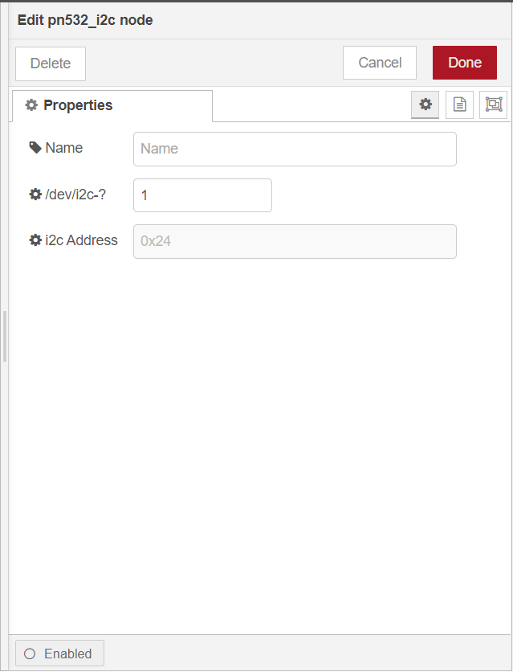

# @rakwireless/pn532-i2c

A node-red node providing access to PN532 to read UID of RFID card.

[](https://www.npmjs.com/package/@rakwireless/pn532-i2c)
[](https://www.npmjs.com/package/@rakwireless/pn532-i2c)

## Install from Node-RED

From within NodeRED, visit the top right menu, select `Manage palette` and then the `Install` tab. Look for `@rakwireless/pn532-i2c` and install it.


## Manual installation (development)

Please install `@rakwireless/pn532-i2c` node with the following commands. If you use docker of Node-RED, you may need to replace `~/.node-red` with `/usr/src/node-red`.

```
git clone https://github.com/RAKWireless/node-red-nodes.git
```

```
cp -rf node-red-nodes/node-red-contrib-pn532-i2c ~/.node-red/node_modules
```

```
cd ~/.node-red/node_modules/node-red-contrib-pn532-i2c && npm install
```

**Tips:**  After `@rakwireless/pn532-i2c` being installed,  **Node-RED should be restarted**, otherwise, the node cannot be found on the page.

## Usage

To get  UID of RFID card from PN532 you just need to select the correct settings for your device and trigger the node.

	

- **Name**

  Define the msg name if you wish to change the name displayed on the node.

- **/dev/i2c-?**

  Default I2C Bus is 1.  `1` is for `'/dev/i2c-1'`.

- **i2c_Address**

  The Address for pn532 is 0x24 which can not be changed. 


## Example

[rak13600-nfc-read](https://github.com/RAKWireless/node-red-nodes/tree/master/node-red-contrib-pn532-i2c/examples/rak13600-nfc-read)  - Read NFC tag information by rak13600.


## License

This project is licensed under MIT license.
