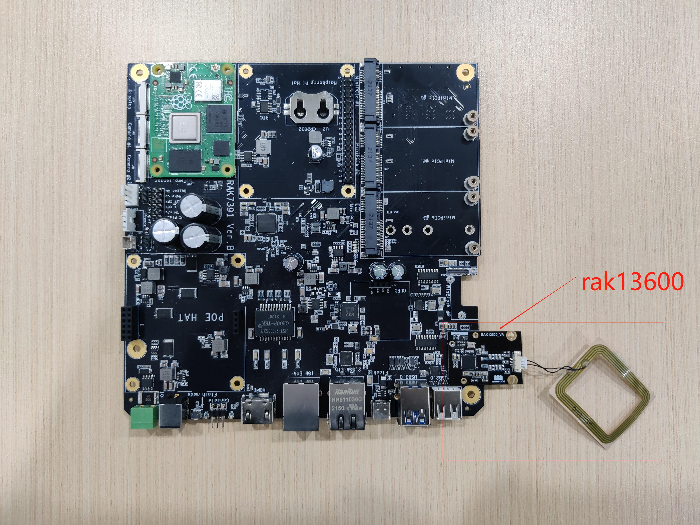
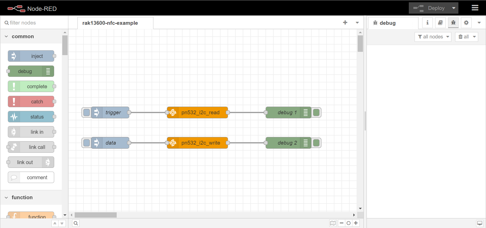
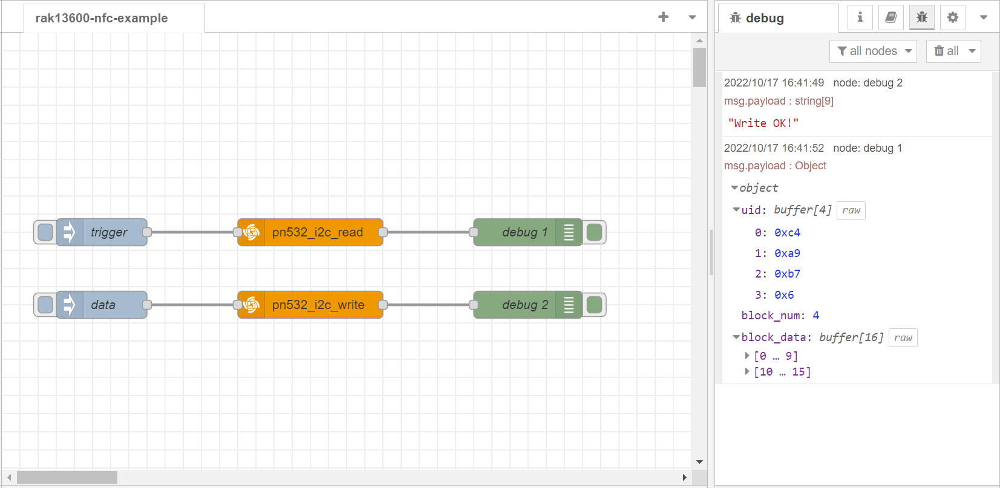

# Extend RAK13600 in RAK7391 board and test it with NodeRed

## 1. Introduction

This guide explains how to create a flow and then use the node **node-red-contrib-pn532-i2c** to test [RAK13600](https://store.rakwireless.com/products/rak13600-wisblock-nfc-reader) that use it to read id of RFID card and transfers the id to owner's name of RFID.  RAK13600 use `i2c-1` of RAK7391 board. 

### 1.1 Requirements

If you use docker to run Node-RED,  you need to ensure that the user has I2C operation permission.


## 2. Preparation

### 2.1. Harware

#### 2.1.1 RAK13600 

WisBlock NFC Reader RAK13600 enables reading and writing of NFC tags (RFID cards, NFC enabled devices like phones). It is an WisBlock IO module with an external NFC antenna to connect with the NFC devices.


 It needs to connect with NFC antenna as follows:

 


#### 2.1.2 Connection diagram

Connect RAK13600  to RAK7391 board.




### 2.2. Software

Please install `node-red-contrib-pn532-i2c` node with the following commands. If you install Node-Red in a docker, you may need to replace `~/.node-red` with `/usr/src/node-red`.

```
git clone https://git.rak-internal.net/product-rd/gateway/wis-developer/rak7391/node-red-nodes.git
```

```
cp -rf node-red-nodes/node-red-contrib-pn532-i2c ~/.node-red/node_modules
```

```
cd ~/.node-red/node_modules/node-red-contrib-pn532-i2c && npm install
```

**Tips:**  After `node-red-contrib-pn532-i2c` being installed,  **node-red should be restarted**, otherwise, the node cannot be found on the page.

## 3. Run example

The example is under `rak13600-nfc` folder. Then you can import the  **rak13600-example-flow.json** file or just copy and paste the .json file contents into your new flow.

After the import is done, the new flow should look like this:



Hit the **Deploy** button on the top right to deploy the flow.

This example flow  contains two parts, click the `trigger` node to read the block data from a NFC/RFID card, the default block number is 4, click the `data` node to write the block data to a NFC/RFID card, the result  is shown as below.




## 4. License

This project is licensed under MIT license.
