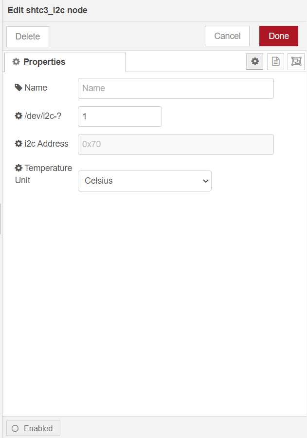

@rakwireless/shtc3
==================================

A Node-RED node providing access to an SHTC3 temperature and humidity sensor.

[](https://www.npmjs.com/package/@rakwireless/shtc3)
[](https://www.npmjs.com/package/@rakwireless/shtc3)

## Install from Node-RED

From within NodeRED, visit the top right menu, select `Manage palette` and then the `Install` tab. Look for `@rakwireless/shtc3` and install it.


## Manual installation (development)

Please install `@rakwireless/shtc3` node with the following commands. If you use docker of Node-RED, you may need to replace `~/.node-red` with `/usr/src/node-red`.

```
git clone https://github.com/RAKWireless/node-red-nodes.git
```

```
cp -rf node-red-nodes/node-red-contrib-shtc3 ~/.node-red/node_modules
```

```
cd ~/.node-red/node_modules/node-red-contrib-shtc3 && npm install
```

**Tips:**  After `@rakwireless/shtc3` being installed,  **Node-RED should be restarted**, otherwise the node cannot be found on the page.

## Usage

**NOTE**: Please make sure that the user running Node-RED has the permissions to access I2C devices. 

- **shtc3_i2c**

​		To get value of  temperature and humidity you just need to select the correct settings for your device and trigger the node.

​			

​		**Name**

​			Define the msg name if you wish to change the name displayed on the node.

​		**/dev/i2c-?**

​			Default I2C Bus is 1.  `1` is for `/dev/i2c-1`.

​		**i2c_Address**

​			The Address for shtc3 is `0x70` which can not be changed. 

​		**Temperature Unit**

​			You can select `Celsius` or `Fahrenheit` as you like.


The output of the node is a payload contains `temperature` and `humidity` data.

```
{
	temperature: "34.72 °C"
	humidity: "17.92 %"
}
```


## Example

- [shtc3-read](./node-red-contrib-shtc3/examples/shtc3-read) -  Read temperature and humidity data from shtc3 sensor.


## License

This project is licensed under MIT license.
