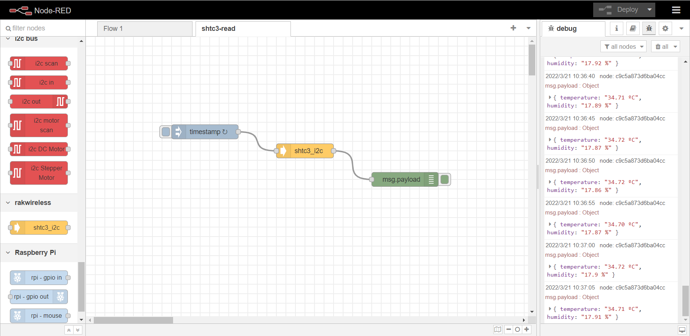

node-red-contrib-shtc3
==================================

A node-red node providing access to a shtc3 temperature and humidity sensor.

---

## Install

Please install `node-red-contrib-shtc3` node with the following commands. If you use docker of Node-RED, you may need to replace `~/.node-red` with `/usr/src/node-red`.

```
git clone -b dev https://git.rak-internal.net/product-rd/gateway/wis-developer/rak7391/node-red-nodes.git
```

```
cp -rf node-red-nodes/node-red-contrib-shtc3 ~/.node-red/node_modules
```

```
cd ~/.node-red/node_modules/node-red-contrib-shtc3 && npm install
```

**Tips:**  After `node-red-contrib-shtc3` being installed,  **node-red should be restarted**, otherwise, the node cannot be found on the page.

## Usage

To get value of  temperature and humidity you just need to select the correct settings for your device and trigger the node.

	

- **Name**

  Define the msg name if you wish to change the name displayed on the node.

- **/dev/i2c-?**

  Default I2C Bus is 1.  `1` is for `'/dev/i2c-1'`.

- **i2c_Address**

  The Address for shtc3 is 0x70 which can not be changed. 

- **Temperature Unit**

  You can select `Celsius` or `Fahrenheit` as you like.


## Example

Copy the following JSON data to a file and rename file as shtc3-read.json.

Import the json file to Node-RED then deploy the flow.

```
[
    {
        "id": "c583276973d6ef77",
        "type": "tab",
        "label": "shtc3-read",
        "disabled": false,
        "info": "The exampe is that read temperature and humidity data from shtc3 in RAK7391 every 5 seconds.",
        "env": []
    },
    {
        "id": "f26568b4e366c7f3",
        "type": "shtc3_i2c",
        "z": "c583276973d6ef77",
        "name": "",
        "i2c_device_number": 1,
        "i2c_address": "0x70",
        "temperature_unit": "fahrenheit",
        "x": 460,
        "y": 240,
        "wires": [
            [
                "c9c5a873d6ba04cc"
            ]
        ]
    },
    {
        "id": "47059eaa4081f416",
        "type": "inject",
        "z": "c583276973d6ef77",
        "name": "",
        "props": [
            {
                "p": "payload"
            },
            {
                "p": "topic",
                "vt": "str"
            }
        ],
        "repeat": "5",
        "crontab": "",
        "once": false,
        "onceDelay": 0.1,
        "topic": "",
        "payload": "",
        "payloadType": "date",
        "x": 250,
        "y": 200,
        "wires": [
            [
                "f26568b4e366c7f3"
            ]
        ]
    },
    {
        "id": "c9c5a873d6ba04cc",
        "type": "debug",
        "z": "c583276973d6ef77",
        "name": "",
        "active": true,
        "tosidebar": true,
        "console": false,
        "tostatus": false,
        "complete": "false",
        "statusVal": "",
        "statusType": "auto",
        "x": 670,
        "y": 300,
        "wires": []
    }
]
```

After deploy, we can get data of temperature and humidity as follows. 



## License

This project is licensed under MIT license.
