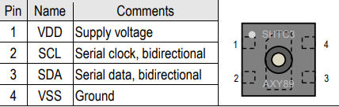
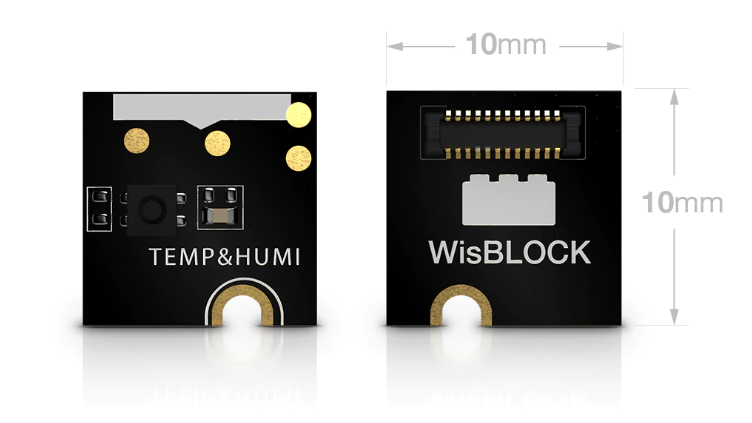
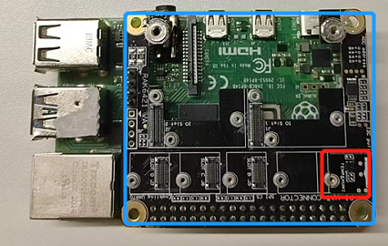
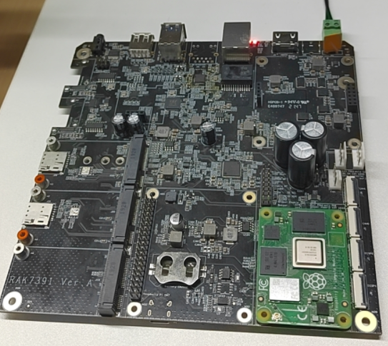
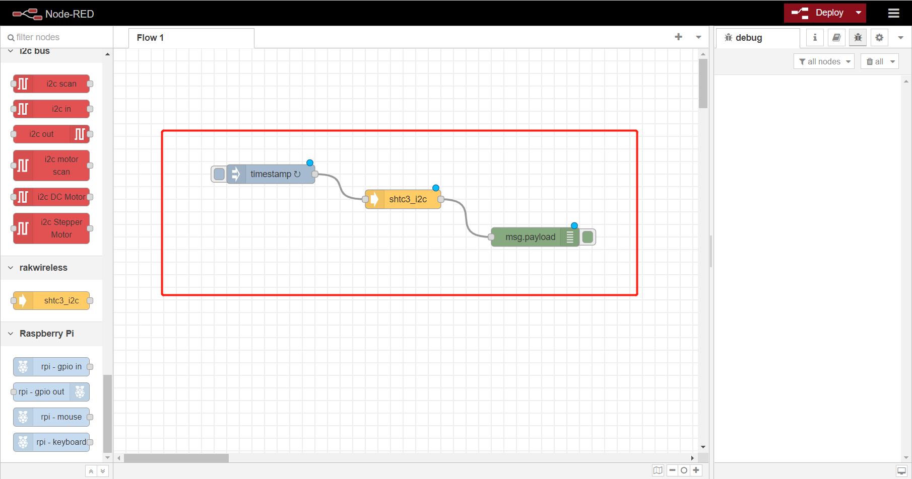

# Read temperature and humidity data from shtc3 sensor

## 1. Introduction

### 1.1 Shtc3

This guide explains how to create a flow and then use the node **node-red-contrib-shtc3** to read the data of temperature and humidity  from shtc3 sensor.  Its pin-map is showed as follows.



### 1.2 RAK1901

[RAK1901](https://store.rakwireless.com/products/rak1901-shtc3-temperature-humidity-sensor) is a WisBlock Sensor that extends the WisBlock system with a temperature and humidity sensor. 



## 2. Preparation

### 2.1. Hardware

There are two ways to use shtc3  sensor in this example:

- **Raspberry Pi 4B  + RAK6421 WisBlock Hat +  RAK1901**

​								

- **Raspberry Pi CM4  + RAK7391 WisGate Developer Connect**

  Since the shtc3 sensor is already in RAK7391 board, we no need use another shtc3 sensor.

​						

### 2.2. Software

Please install `node-red-contrib-shtc3` node with the following commands. If you use docker of Node-RED, you may need to replace `~/.node-red` with `/usr/src/node-red`.

```
git clone -b dev https://git.rak-internal.net/product-rd/gateway/wis-developer/rak7391/node-red-nodes.git
```

```
cp -rf node-red-nodes/node-red-contrib-shtc3 ~/.node-red/node_modules
```

```
cd ~/.node-red/node_modules/node-red-contrib-shtc3 && npm install
```


## 3. Run example

Import the  [shtc3-read.json](shtc3-read.json)  file into your new flow. Then, the new flow should look like this:



Hit the **Deploy** button on the top right to deploy the flow.

This is a simple flow with three node, where `inject` node supply a trigger event every 5 seconds, `shtc3_i2c`node read data of shtc3, and `debug` node print the temperature and humidity read from shtc3 sensor.

The result is as follows:


## 4. License

This project is licensed under MIT license.
